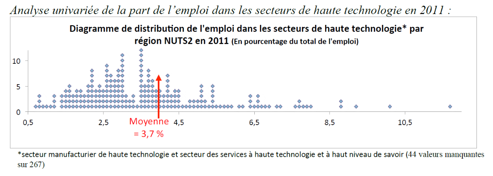
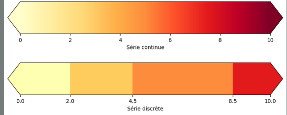
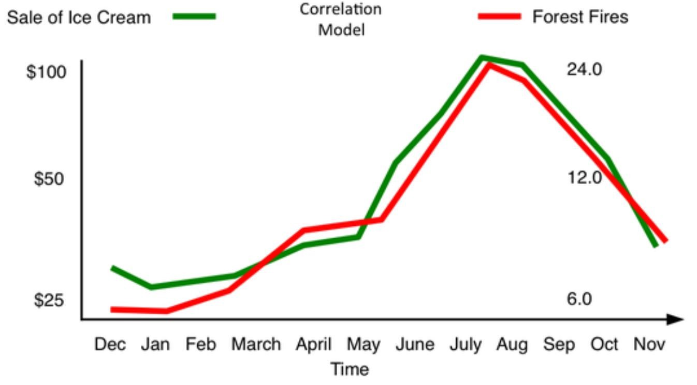
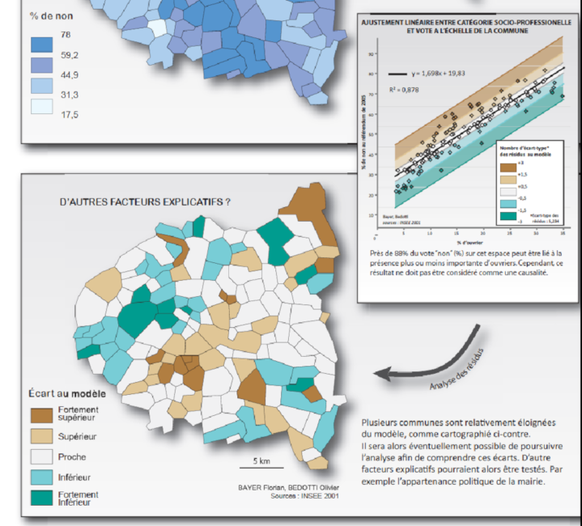
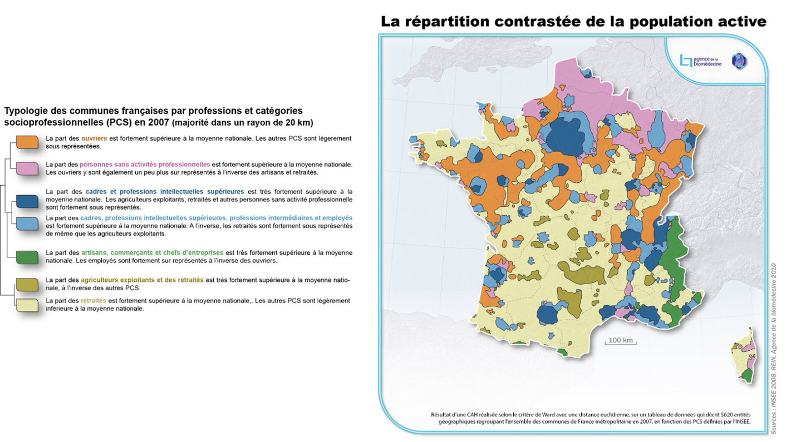
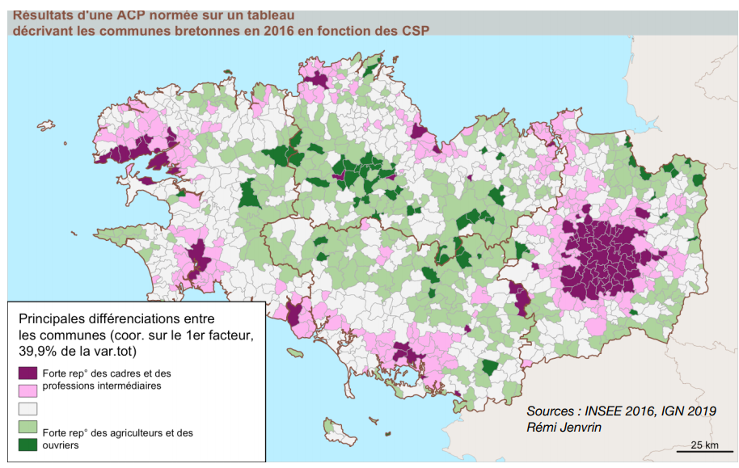

```{r setup, global_options,include=FALSE}
knitr::opts_chunk$set(
  dpi = 200,
  #fig.width = 7,
  #fig.height = 4,
  strip.white = T,
  #dev = "png",
  #dev.args = list(png = list(bg = "transparent")),
  message=FALSE,
  comment=NA,
  echo=FALSE,
  warning=FALSE,
  eval=TRUE
  
)
```

```{r include=FALSE}
source('./assets/functions.R')

# Les librairies
requiredPackages = c('knitr','png','grid','gridExtra',
                     'RColorBrewer','dotenv')

PackageFacile(requiredPackages)

load_dot_env(".env")
annee=Sys.getenv("annee")

```


class: center, middle, inverse, title-slide, animated, fadeIn
# Analyse des données Licence Pro `r annee`
# Présentation du cours <br /> 
<br />
### Florian Bayer


<div class="my-footer"><span>ENSG - Licence Pro `r annee` : analyse de données - Florian Bayer</span></div> 

---
class: animated, fadeIn
## Déroulement des séances
   
- 4 séances de 3 heures
- CM puis TD
- florian.bayer@gmail.com

<div class="my-footer"><span>ENSG - Licence Pro `r annee` : analyse de données - Florian Bayer</span></div> 

---
class: animated, fadeIn
##  Contenu de l’enseignement
<div class="my-footer"><span>ENSG - Licence Pro `r annee` : analyse de données - Florian Bayer</span></div> 
- **Acquérir les bonnes pratiques de la démarche scientifique** : Introduction aux méthodes rigoureuses de recherche et d'analyse scientifique.
- **Les statistiques appliquées à la cartographie** : Compréhension des concepts statistiques et de leur utilisation pour l'analyse et la représentation géographique des données.
- **Principes et méthodes de traitement en analyse de données** : Initiation aux bases de l'analyse de données et l'interprétation des résultats. La collecte des données n'est pas abordée.
- **Analyse univariée et bivariée** sur des données quantitatives : Exploration des techniques d'analyse de variables uniques et des relations entre deux variables (corrélation).
- **Méthodes de discrétisation** : Techniques de regroupement des données en classes pour une meilleure interprétation visuelle.
- **Séances de TD pratiques** : Des travaux dirigés permettent aux étudiants de mettre en pratique les connaissances acquises à travers des exercices concrets.


---
class: inverse, center, middle, animated, fadeIn
# Contenu de l'enseignement

<div class="my-footer-title "></div> 

---
class: animated, fadeIn
## Univarié


- Distinguer les types de **variables**, de **distributions**. **Décrire** une série de données, utiliser les **méthodes appropriées** à chaque type de données.
- Connaître les **principes** et **méthodes** de traitement et d’analyse de données.
- Maîtriser différentes méthodes de **représentation** de l’information statistique en géographie (notamment graphiques et cartographiques).
- N.B. L'analyse univariée est une étape obligatoire avant toutes les analyses statistiques les plus complexes.

.center-img[
```{r echo=FALSE, out.width="90%"}

```
]

<div class="my-footer"><span>ENSG - Licence Pro `r annee` : analyse de données - Florian Bayer</span></div> 

---
class: animated, fadeIn
## Discrétisation

En fonction de votre analyse univariée, de vos objectifs et de votre public :
- Appliquer la méthode de discrétisation la plus adaptée

.center-img[
```{r echo=FALSE, out.width="100%"}

```
]

<div class="my-footer"><span>ENSG - Licence Pro `r annee` : analyse de données - Florian Bayer</span></div> 


---
class: animated, fadeIn
## Bivarié

- Mesurer l’**intensité** de la **relation** entre deux variables *quantitatives* à l’aide de la corrélation.
- **Modéliser** la nature d’une relation entre deux variables à l’aide des analyses de régression linéaire.

.center-img[
```{r echo=FALSE, out.width="70%"}

```
]
<div class="my-footer"><span>ENSG - Licence Pro `r annee` : analyse de données - Florian Bayer</span></div> 

---
class: animated, fadeIn
## Exemple d'application
<div style="display:table-cell; vertical-align:middle; horizontal-align:center">


.center-img[
```{r echo=FALSE, out.width="100%"}
knitr::include_graphics("./assets/images/1_Intro/stat1.png")
```
]

</div>

<div class="my-footer"><span>ENSG - Licence Pro `r annee` : analyse de données - Florian Bayer</span></div> 

---
class: animated, fadeIn
## Exemple d'application

.center-img[
```{r echo=FALSE, out.width="75%"}

```
] 

<div class="my-footer"><span>ENSG - Licence Pro `r annee` : analyse de données - Florian Bayer</span></div> 

---
class: animated, fadeIn
## Exemple (non abordé cette année)
<div style="display:table-cell; vertical-align:middle; horizontal-align:center">

.center-img[
```{r echo=FALSE, out.width="100%"}

```
] 

<div class="my-footer"><span>ENSG - Licence Pro `r annee` : analyse de données - Florian Bayer</span></div> 

---
class: animated, fadeIn
## Exemples (non abordé cette année)

.center-img[
```{r echo=FALSE, out.width="100%"}

```
]

<div class="my-footer"><span>ENSG - Licence Pro `r annee` : analyse de données - Florian Bayer</span></div> 


