```{r setup, global_options,include=FALSE}
knitr::opts_chunk$set(
  dpi = 200,
  #fig.width = 7,
  #fig.height = 4,
  strip.white = T,
  #dev = "png",
  #dev.args = list(png = list(bg = "transparent")),
  message=FALSE,
  comment=NA,
  echo=FALSE,
  warning=FALSE,
  eval=TRUE
  
)
```

```{r include=FALSE}
source('./assets/functions.R')

# Les librairies
requiredPackages = c('knitr','datasets','kableExtra','ggplot2','plotly',
                     'widgetframe','reshape','dplyr','dotenv')

PackageFacile(requiredPackages)

load_dot_env(".env")
annee=Sys.getenv("annee")

```


class: center, middle, inverse, title-slide, animated, fadeIn
# Analyse des données Licence Pro `r annee`
# Cours n°2- l'analyse univariée<br /> <br />
### Florian Bayer


<div class="my-footer"><span>Géodata Paris - Licence Pro `r annee` : analyse de données - Florian Bayer</span></div> 

---
class: animated, fadeIn
## Objectifs du cours
<div class="my-footer"><span>Géodata Paris - Licence Pro `r annee` : analyse de données - Florian Bayer</span></div> 

L’analyse d’une série de données est une étape obligatoire de **toutes** productions scientifiques. 

Si on s'intéresse aux caractères pris un à un, on parle d'analyse **univariée**.

Elle permet :
- De mieux **comprendre** les données les unes par rapport aux autres (série homogène ? Hétérogène ?).
- De mettre en évidence les **valeurs remarquables**.
- Elle permet **résumer** l’information.
- Elle donne les éléments scientifiques pour **justifier et reproduire** ses choix.

--

Ce qui se traduit aussi en cartographie par : 
- Trouver le meilleur **compromis** entre information statistique et information géographique. 
- **Résumer** l’information tout en conservant la **forme de la distribution**.
- Si besoin de mettre en évidence les **valeurs remarquables** et de les faire apparaître sur la carte. 
- Choisir la méthode de **discrétisation** la plus adaptée à vos données. 

---
class: animated, fadeIn
## Objectifs du cours
<div class="my-footer"><span>Géodata Paris - Licence Pro `r annee` : analyse de données - Florian Bayer</span></div> 

L’analyse univariée se fait à l’aide de la combinaison **graphiques** et **calculs** : 

- Les graphiques permettent de visualiser instantanément les caractéristiques d'une ou de plusieurs séries.
- Les calculs statistiques donnent des éléments factuels et reproductibles.

---
class: inverse, center, middle, animated, fadeIn  
# 1- Analyse univariée : les graphiques

<div class="my-footer-title "></div> 

---
class: animated, fadeIn
## Intérêt

<div class="my-footer"><span>Géodata Paris - Licence Pro `r annee` : analyse de données - Florian Bayer</span></div> 


.font90[*« La représentation des données sous forme numérique n’a souvent qu’une assez faible lisibilité immédiate. Il est alors important de pouvoir utiliser des moyens qui améliorent l’appréhension, l’interprétation et la communication des données statistiques »* **[Dumolard et al.,2003]**]

.pull-left1[
.font80[Température quotidienne de 5 villes en 2024 (source : Open-Meteo, réanalyse ERA5)]
```{r echo=FALSE, out.width="70%"}

# Données : Open-Meteo (réanalyse ERA5), voir data/meteo_2024.R
meteo <- read.csv("./data/meteo_2024.csv", encoding = "UTF-8")
meteo$date <- as.Date(meteo$date)
meteo$ville <- factor(meteo$ville, levels = c("Brest", "Paris", "Strasbourg", "Marseille", "Chamonix"))
meteo.bs <- meteo %>% dplyr::filter(ville %in% c("Brest", "Strasbourg")) %>% droplevels()

meteo %>%
  dplyr::select(date, ville, temperature) %>%
  arrange(date, ville) %>%
  rename(`t° (°C)` = temperature) %>%
  kable() %>%
  kable_styling(font_size = 12) %>%
  scroll_box(width = "250px", height = "350px")

```
]


--

.pull-right3[
```{r echo=FALSE, out.width="100%"}

p <- ggplot(meteo.bs, aes(date, temperature, color = ville)) +
  geom_line(linewidth = 0.4) +
  xlab("") + ylab("t° C")

t <- list(
  size = 10)


frameWidget(ggplotly(p) %>% layout(title="",
         font=t), width='100%', height='100%') 

```

]


---
class: animated, fadeIn
## Des graphiques en fonction des données

Selon le type de données (qualitatives / quantitatives, discrètes ou continues), les outils  permettant de décrire l’information statistique ne sont pas les mêmes.

.center-img[
```{r echo=FALSE, out.width="70%"}
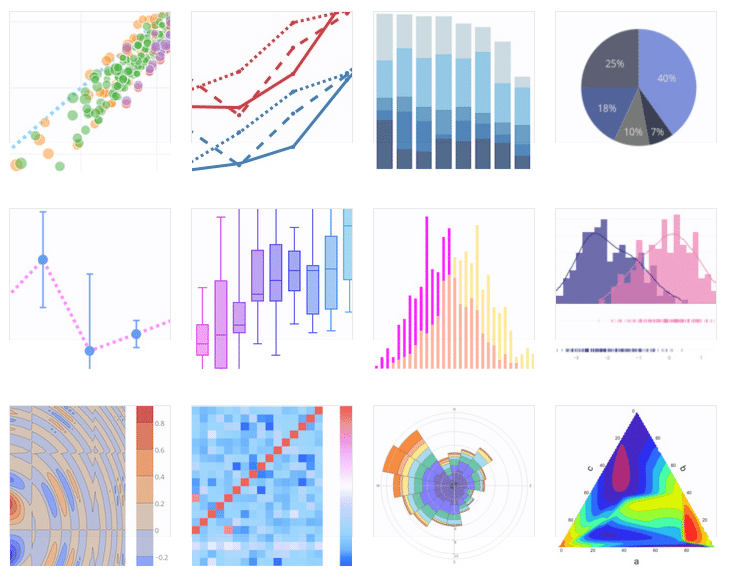
```
] 

<div class="my-footer"><span>Géodata Paris - Licence Pro `r annee` : analyse de données - Florian Bayer</span></div> 

---
class: animated, fadeIn
## Les diagrammes en bâton

<div class="my-footer"><span>Géodata Paris - Licence Pro `r annee` : analyse de données - Florian Bayer</span></div> 


On représente généralement les **données qualitatives discrètes / exhaustives** à l'aide d'un diagramme en bâton. Il faut réaliser un **dénombrage** à l’aide un tableau de contingence. 

Le diagramme en bâton : 
- La hauteur de chaque bâtons (y) est égale au nombre d’individus dans la modalité correspondante.
- Les variables discrètes sont en abscisse (x).

C'est donc la représentation d'une variable qualitative pondérée par le nombre d'occurence de la valeur dans le tableau.

<div class="my-footer"><span>Géodata Paris - Licence Pro `r annee` : analyse de données - Florian Bayer</span></div> 

---
class: animated, fadeIn
## Les diagrammes en bâton : exemple 1

<div class="my-footer"><span>Géodata Paris - Licence Pro `r annee` : analyse de données - Florian Bayer</span></div> 

On peut compter puis représenter le nombre de jours de pluie (au moins 1 mm) de chaque ville en 2024 à l'aide d'un dénombrement
.pull-left[
```{r echo=FALSE, out.width="100%"}

pluie <- meteo %>% dplyr::filter(precipitation >= 1)

pluie %>%
  count(ville, sort = TRUE, name = "Jours de pluie") %>%
  kable() %>%
  kable_styling(bootstrap_options = "striped", full_width = F,font_size = 18) 

```
]

.pull-right[
```{r echo=FALSE, out.width="100%"}

p <- ggplot(pluie, aes(ville, fill = ville)) + 
  geom_bar(stat = 'count',width = 0.5)+ ggtitle("Nombre de jours de pluie en 2024") +
  xlab("") + ylab("")+ scale_y_continuous(breaks=seq(0, 250, by=25)) + theme(legend.position = "none")

p

```
]

---
class: animated, fadeIn
## Les diagrammes en bâton : exemple 2

<div class="my-footer"><span>Géodata Paris - Licence Pro `r annee` : analyse de données - Florian Bayer</span></div> 

On peut également calculer la moyenne, le minimum, le maximum etc. des températures quotidiennes de chaque ville.

Sur le graphique, la **hauteur de la barre** correspond à la **température moyenne** et le **trait vertical** va du **minimum** au **maximum** de l'année. Ce n'est pas une barre d'erreur au sens statistique.

.pull-left[
```{r echo=FALSE, out.width="100%"}

meteo.mean <- meteo %>% group_by(ville) %>%
  summarize(Moyenne = round(mean(temperature),1), Min = round(min(temperature),1), Max = round(max(temperature),1))

meteo.mean %>%
  kable() %>%
  kable_styling(bootstrap_options = "striped", full_width = F,font_size = 18) 

```
]

.pull-right[
```{r echo=FALSE, out.width="100%"}


p<- ggplot(meteo.mean, aes(x = ville, y = Moyenne, ymin = Min, ymax = Max, fill = ville)) + 
  geom_bar(stat = "identity",width = 0.5) + 
  geom_errorbar(width = 0.3)+ ggtitle("t° moyenne (barre), minimale et maximale (trait) en 2024") +
  xlab("") + ylab("température °C")+ scale_y_continuous(breaks=seq(-10, 30, by=5))+ 
  theme(legend.position = "none")

p

```
]


---
class: animated, fadeIn
## Les histogrammes 

Les données de stock se représentent par un **histogramme** et non un diagramme en bâton. La surface à représenter doit être proportionnelle à la quantité contenue dans la classe.

L’idéal est de créer des **classes d’amplitudes égales** (les classes vont de 10 en 10 ou de 20 en 20). Le graphique ressemblera alors à un diagramme en bâton, sans discontinuité.

Si les classes ne sont pas de même amplitudes (de 10 à 20, puis de 20 à 120), la surface de la colonne (et non sa hauteur) doit être proportionnelle au nombres d’individus représentés. Dans la cas contraire, l’impression visuelle ne sera pas conforme à la réalité. Peu de logiciels proposent cette foncitonnalité, il est donc préférable de faire des classes d'amplitudes égales.

.center-img[
```{r echo=FALSE, out.width="70%"}
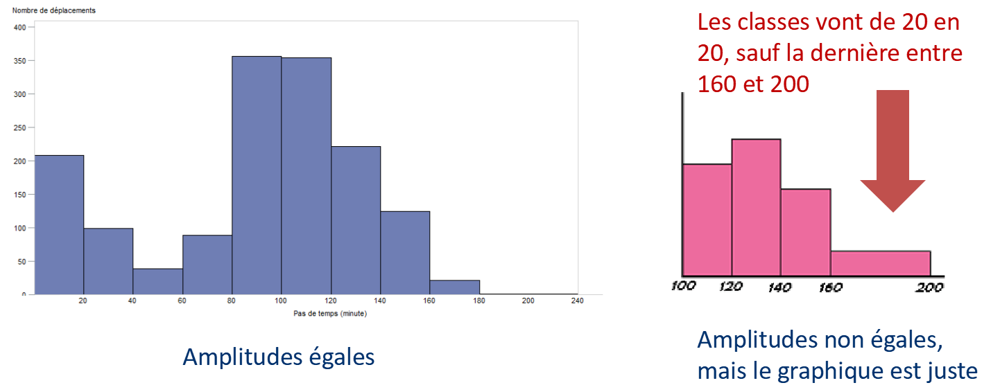
```
] 

<div class="my-footer"><span>Géodata Paris - Licence Pro `r annee` : analyse de données - Florian Bayer</span></div> 

---
class: animated, fadeIn
## Les histogrammes : exemples

Effet du nombre de classes sur la représentation.

.pull-left[
```{r echo=FALSE, out.width="100%"}

p <- ggplot(meteo.bs, aes(x=temperature,fill = ville, color = ville))+
  geom_histogram(alpha=0.5, binwidth  = 2,boundary = 0, closed = "left") + ggtitle("Classes de 2° d'amplitude") +
  xlab("Classes de température") + ylab("Nombre de jours") + theme(legend.position = "none") +
  facet_grid(ville ~ .) 

p

```
]
.pull-right[
```{r echo=FALSE, out.width="100%"}

p <- ggplot(meteo.bs, aes(x=temperature,fill = ville, color = ville))+
  geom_histogram(alpha=0.5, binwidth  = 0.5,boundary = 0, closed = "left") + ggtitle("Classes de 0.5° d'amplitude") +
  xlab("Classes de température") + ylab("Nombre de jours") + theme(legend.position = "none") +
  facet_grid(ville ~ .) 

p
```
]

Les données sont les mêmes pour les deux séries, mais les **amplitudes** des classes des histogrammes sont différentes : de 2° en 2° à gauche, de 0.5° en 0.5° à droite.

<div class="my-footer"><span>Géodata Paris - Licence Pro `r annee` : analyse de données - Florian Bayer</span></div> 

---
class: animated, fadeIn
## Diagramme en bâton ? Histogramme ?

Attention à ne pas confondre histogramme et diagramme en bâton. Sous Excel, l’histogramme correspond en réalité au diagramme en bâton...

.center-img[
```{r echo=FALSE, out.width="90%"}
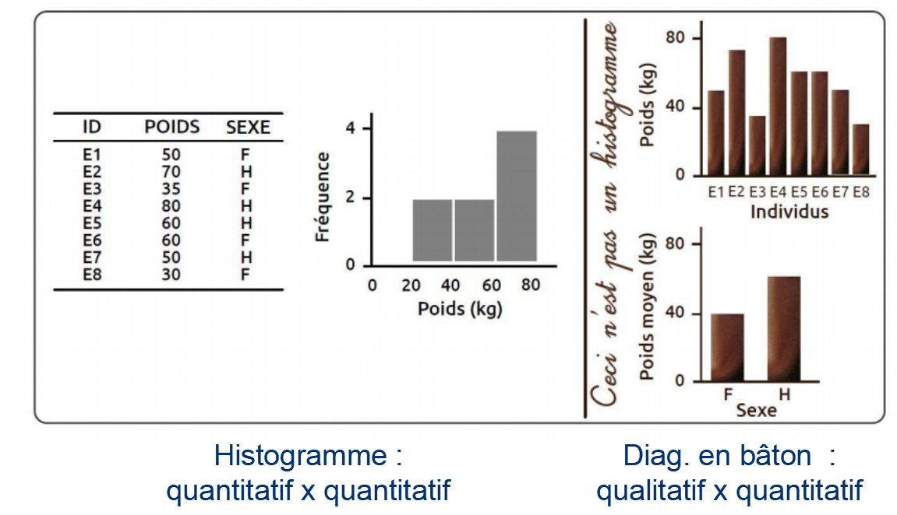
```
] 

<div class="my-footer"><span>Géodata Paris - Licence Pro `r annee` : analyse de données - Florian Bayer</span></div> 


---
class: animated, fadeIn
## La forme de la distribution statistique

Les histogrammes permettent de décrire la **forme** d'une série statistique. On peut la caractériser par 
- le mode
- la symétrie


<div class="my-footer"><span>Géodata Paris - Licence Pro `r annee` : analyse de données - Florian Bayer</span></div> 

---
class: animated, fadeIn
## Le mode de la série

.pull-left[
- La série est **<span style="color:#f8766d">unimodale</span>** : les données sont concentrées autours d’un seul point (Brest, climat océanique).
- La série est **<span style="color:#00bfc4">multimodale</span>** : les données sont concentrées autours d’un mode principale et un ou plusieurs modes secondaires (Strasbourg, un mode d'hiver et un mode d'été).
]

.pull-right[
```{r echo=FALSE, out.width="100%"}

# modes repérés sur des classes de 2°C
classes <- meteo.bs %>%
  mutate(classe = floor(temperature / 2) * 2 + 1) %>%
  count(ville, classe)
mode_brest <- classes %>% dplyr::filter(ville == "Brest") %>% slice_max(n, n = 1, with_ties = FALSE)
mode_hiver <- classes %>% dplyr::filter(ville == "Strasbourg", classe < 10) %>% slice_max(n, n = 1, with_ties = FALSE)
mode_ete   <- classes %>% dplyr::filter(ville == "Strasbourg", classe >= 10) %>% slice_max(n, n = 1, with_ties = FALSE)

dat_text <- data.frame(
  label = c("mode", "mode hiver", "mode été"),
  ville = factor(c("Brest", "Strasbourg", "Strasbourg"), levels = levels(meteo.bs$ville)),
  x     = c(mode_brest$classe, mode_hiver$classe, mode_ete$classe),
  y     = c(mode_brest$n, mode_hiver$n, mode_ete$n) + 8
)

ggplot(meteo.bs, aes(x=temperature,fill = ville, color = ville))+
  geom_histogram(alpha=0.5, binwidth  = 2,boundary = 0, closed = "left") + 
  xlab("Classes de température") + ylab("Nombre de jours") + theme(legend.position = "none") +
  facet_grid(ville ~ .) + 
  geom_text(data    = dat_text, mapping = aes(x = x, y = y, label = label)
)

```
]


<div class="my-footer"><span>Géodata Paris - Licence Pro `r annee` : analyse de données - Florian Bayer</span></div> 

---
class: animated, fadeIn
## La symétrie de la série

.pull-left[
- La série est **<span style="color:#f8766d">symétrique</span>** : toutes les valeurs sont proches, il y a peu ou pas de valeurs extrêmes.
- **<span style="color:#00ba38">Dissymétrique à gauche</span>** : beaucoup de valeurs faibles, peu de valeurs élevées.
- **<span style="color:#619cff">Dissymétrique à droite</span>** : beaucoup de valeurs élevées, peu de valeurs faibles.
]

.pull-right[
```{r echo=FALSE, out.width="100%"}

sym <- bind_rows(
  meteo %>% dplyr::filter(ville == "Brest") %>% transmute(serie = "Température à Brest (°C)", valeur = temperature),
  meteo %>% dplyr::filter(ville == "Marseille") %>% transmute(serie = "Précipitations à Marseille (mm)", valeur = precipitation),
  meteo %>% dplyr::filter(ville == "Brest") %>% transmute(serie = "Nébulosité à Brest (%)", valeur = nebulosite)
)
sym$serie <- factor(sym$serie, levels = unique(sym$serie))

ggplot(sym, aes(x=valeur,fill = serie, color = serie))+
  geom_histogram(alpha=0.5, bins = 25, boundary = 0, closed = "left") + 
  xlab("") + ylab("Nombre de jours") + theme(legend.position = "none") +
  facet_wrap(serie ~ ., ncol = 1, scales = "free")

```
]

Cette approche graphique permet déjà de poser des hypothèses sur nos données : à Brest, les températures varient peu autour de la moyenne (climat océanique) ; à Marseille, la plupart des jours sont secs, avec quelques épisodes de fortes pluies ; à Brest, le ciel est le plus souvent très couvert.

<div class="my-footer"><span>Géodata Paris - Licence Pro `r annee` : analyse de données - Florian Bayer</span></div> 

---
class: animated, fadeIn
## Les graphiques : premières notions clés

Pour caractériser une série, il est possible dans un premier temps de la représenter graphiquement :
- par un diagramme en bâton (qualitatif x quantitatif).
- Ou un histogramme (quantitatif x quantitatif).
- D’autres méthodes sont possibles (diagramme de distribution, courbe de fréquence cumulée), l'une d'elle sera abordée dans la partie suivante (boxplot).

Cette approche graphique permet de déterminer si la série possède des valeurs plutôt proches les unes des autres ou au contraire très hétérogènes.

Un graphique est simple à comprendre, mais son interprétation peut-être **subjective**. Il faut donc compléter cette approche par des données statistiques.

<div class="my-footer"><span>Géodata Paris - Licence Pro `r annee` : analyse de données - Florian Bayer</span></div> 

---
class: inverse, center, middle, animated, fadeIn  
# 2- Analyse univariée : les valeurs centrales

<div class="my-footer-title "></div> 

---
class: animated, fadeIn
## Intérêt

Une série de données **doit être caractérisée** par des calculs **scientifiques**, c’est-à-dire une méthode :
- objective
- factuelle
- et reproductible.

Les principaux outils de l’analyse univariée peuvent être classer en 2 familles :
- Les valeurs centrales.
- Les paramètres de dispersions.

<div class="my-footer"><span>Géodata Paris - Licence Pro `r annee` : analyse de données - Florian Bayer</span></div> 

---
class: inverse, center, middle, animated, fadeIn  
# 2.1 - Les valeurs centrales

<div class="my-footer-title "></div> 

---
class: animated, fadeIn
## Les valeurs centrales

Elles permettent de **résumer** une série en une seule valeur. Il existe 3 types de valeurs centrales :
- Moyenne
- Médiane
- Mode (classe modale)

Elles n’ont pas la même signification et doivent donc être toutes calculées lorsque l’on souhaite résumer une série statistique (quitte à conserver la plus adaptée à la fin).

A noter que la classe modale est la seule valeur centrale utilisable pour les données qualitatives, après dénombrement (cf. diagramme en baton)

<div class="my-footer"><span>Géodata Paris - Licence Pro `r annee` : analyse de données - Florian Bayer</span></div> 

---
class: animated, fadeIn
## Moyenne

<div class="my-footer"><span>Géodata Paris - Licence Pro `r annee` : analyse de données - Florian Bayer</span></div> 

La somme de l’ensemble des valeurs de la série statistique, divisée par le nombre d’éléments de la série (moyenne arithmétique)

- Fréquemment utilisée, la moyenne se base sur **l'ensemble des données** de la série.
- Formule Excel : =moyenne().
- Elle présente l'inconvénient d'être **influencée par les valeurs extrêmes**. Elle n'est donc pas toujours représentative de la série.

--

Il existe beaucoup de variations de la moyenne. Par exemple :
- la moyenne tronquée qui consiste à supprimer du calcul le minimum et le maximum afin d'éliminer l'influence des valeurs extrêmes. On peut aussi supprimer les 10% les plus faibles et fortes.
- La moyenne pondérée, en multipliant chaque valeur par un poids, puis diviser la somme par la somme des poids. Très utile si les individus statistiques sont très hétérogènes (population des départements français).


---
class: animated, fadeIn
## Médiane
<div class="my-footer"><span>Géodata Paris - Licence Pro `r annee` : analyse de données - Florian Bayer</span></div> 

La valeur qui partage une série ordonnée en **deux sous ensembles d'effectifs égaux** : 50 % des éléments ont des valeurs supérieures à la médiane et 50% ont des valeurs inférieures. Pour la série [1;2;3;4;5] médiane = 3).

- Si il y a un nombre paire de valeurs dans la série, la médiane est la moyenne des deux valeurs centrales (pour la série [1;2;3;4] médiane = 2,5).
- Contrairement à la moyenne, elle **n'est pas influencée par les valeurs extrêmes** puisqu'elle n'est dépendante que des valeurs centrales de la série ordonnée.
- On dit que la médiane est **robuste** aux valeurs extrêmes (outliers).
- Formule Excel : =mediane()

--

.center-img[
```{r echo=FALSE, out.width="58%"}
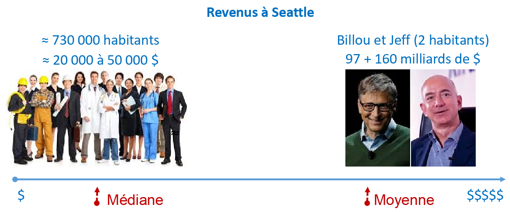
```
] 

---
class: animated, fadeIn
## Mode

Mode ou classe modale / *Formule Excel : =mode()*
- Pour les variables qualitatives ou quantitatives discrètes.
- Valeur ou modalité la plus fréquente d’une série. Elle est issue d’un dénombrement.
- Pour les données continues : hasard si plusieurs valeurs sont identiques. Il faut donc discrétiser la série continue pour trouver le mode, qui sera influencé par la méthode utilisée.

<div class="my-footer"><span>Géodata Paris - Licence Pro `r annee` : analyse de données - Florian Bayer</span></div> 

---
class: animated, fadeIn
## Moyenne, mode et médiane : exemple

.center-img[
```{r echo=FALSE, out.width="60%"}

pluie.bm <- meteo %>% dplyr::filter(ville %in% c("Brest", "Marseille")) %>% droplevels()
stats.bm <- pluie.bm %>% group_by(ville) %>%
  summarize(moyenne = mean(precipitation), mediane = median(precipitation))

dat_text <- data.frame(
  label = c(sprintf("moyenne = %.1f mm", stats.bm$moyenne), sprintf("médiane = %.1f mm", stats.bm$mediane)),
  ville = factor(rep(stats.bm$ville, 2), levels = levels(pluie.bm$ville)),
  x     = 22,
  y     = c(170, 170, 130, 130)
)

ggplot(pluie.bm, aes(x=precipitation,fill = ville, color = ville))+
  geom_histogram(alpha=0.5, binwidth  = 1,boundary = 0, closed = "left") + ggtitle("Précipitations quotidiennes en 2024 : moyenne (tirets) et médiane (trait plein)") +
  xlab("Précipitations (mm)") + ylab("Nombre de jours") + theme(legend.position = "none") +
  coord_cartesian(xlim = c(0, 35)) +
  geom_vline(data = stats.bm, aes(xintercept = moyenne, color = ville), linetype = "dashed") +
  geom_vline(data = stats.bm, aes(xintercept = mediane, color = ville), linetype = "solid") +
  facet_grid(ville ~ .) +
  geom_text(data = dat_text, mapping = aes(x = x, y = y, label = label), hjust = 0)

```
]


<div class="my-footer"><span>Géodata Paris - Licence Pro `r annee` : analyse de données - Florian Bayer</span></div> 

---
class: animated, fadeIn
## Moyenne, mode et médiane : limites 
.pull-left[
*Le résumé d'une distribution que donne une valeur centrale ne nous renseigne pas sur la __dispersion__ des valeurs autour de cette valeur centrale, c'est-à-dire sur la tendance qu'elles-ont à se concentrer ou se disperser autour de celle-ci. (Claude Grasland)*
]

.pull-right[
```{r echo=FALSE, out.width="100%"}

df.prof <- data.frame("Etudiants" = c("A","B","C","D","E","F","G","H","I","Mode","Moyenne","Médiane"),
                      "Notes du Pr. X" = c(7,8,9,10,10,10,11,12,13,10,10,10),
                      "Notes du Pr. Y" = c(0,5,9,10,10,10,11,15,20,10,10,10))


df.prof %>%
  kable() %>%
  kable_styling(bootstrap_options = "striped", full_width = F,font_size = 18) %>%
  row_spec(10:12, bold = T, color = "white", background = "#01326E")

```
]

<div class="my-footer"><span>Géodata Paris - Licence Pro `r annee` : analyse de données - Florian Bayer</span></div> 

---
class: animated, fadeIn
## Moyenne, mode et médiane : limites 2

.pull-left[
Les valeurs centrales sont identiques pour les notes des deux professeurs, mais leur **dispersion** est différente
]

.pull-right[
```{r echo=FALSE, out.width="100%"}


df.prof_melt <- melt(df.prof,  id.vars = "Etudiants")

ggplot(df.prof_melt, aes(x=value,fill = variable, color = variable)) +
  geom_histogram(alpha=0.5, binwidth  = 1, closed = "left")+
  ggtitle("Dispersion des notes") +
  xlab("Notes") + ylab("Fréquence") + theme(legend.position = "none") +
  facet_grid(variable ~ .)

```
]

<div class="my-footer"><span>Géodata Paris - Licence Pro `r annee` : analyse de données - Florian Bayer</span></div> 


---
class: inverse, center, middle, animated, fadeIn  
# 2.2 - Les paramètres de dispersion

<div class="my-footer-title "></div> 

---
class: animated, fadeIn
## Les paramètres de dispersion

Contrairement aux valeurs centrales, les paramètres de dispersion permettent de mesurer la **la tendance qu'ont les valeurs de la distribution à se répartir autours d’une valeur ou bien les unes par rapport aux autres.**

La mesure de cette **variabilité** est au coeur de nombreuses analyses statistique : 
- mesure de la variabilité
- distinguer un effet aléatoire d'une *vrai* variabilité

--

Il existe deux type de paramètres de dispersion :
- dispersion absolue : même unité que le caractère étudié.
- dispersion relative : sans unité mais facilement comparable avec d’autres séries d’unités différentes.

<div class="my-footer"><span>Géodata Paris - Licence Pro `r annee` : analyse de données - Florian Bayer</span></div> 

---
class: animated, fadeIn
## L’étendue

- La différence entre la plus grande valeur de la série et la plus petite. 
- Elle dépend uniquement de deux valeurs.
- Elle est seulement intéressante lorsque les extrêmes ont une signification (exemple : amplitude thermique annuelle sur des moyennes mensuelles).

<div class="my-footer"><span>Géodata Paris - Licence Pro `r annee` : analyse de données - Florian Bayer</span></div> 

---
class: animated, fadeIn
## Ecart absolu moyen

La distance moyenne à la moyenne (moyenne arithmétique de la valeur absolue des écarts à la moyenne).

.pull-left[
```{r echo=FALSE, out.width="90%"}

df.EAM <- data.frame("Etudiants i" = c("A","B","C","D","E","F","G","H","I","Total","Moyenne"),
                      "Xi" = c(7,8,9,10,10,10,11,12,13,90,10),
                      "|Xi-Xmoy|" = c(3,2,1,0,0,0,1,2,3,12,"12/9=1,33"))

df.EAM <- df.EAM %>% dplyr::rename("Etudiants i"  = Etudiants.i, "|Xi-Xmoy|" = X.Xi.Xmoy.)

df.EAM %>%
  kable() %>%
  kable_styling(bootstrap_options = "striped", full_width = F,font_size = 18) %>%
  row_spec(10:11, bold = T, color = "white", background = "#01326E")

```
]

.pull-right[
Les notes s’écartent de 1,33 par rapport à la moyenne : **relativement homogène**.   
Si on fait le calcul pour les notes du professeur *y*, on trouvera 3.6 : **notes hétérogènes**.   
Cet indicateur est facile à comprendre mais n’a pas les propriétés statistiques intéressante. On préfère donc utiliser l'écart-type.   
]


<div class="my-footer"><span>Géodata Paris - Licence Pro `r annee` : analyse de données - Florian Bayer</span></div> 

---
class: animated, fadeIn
## Variance et écart-type

La variance n’est pas un paramètre de dispersion en elle-même, mais une mesure **GLOBALE** de la variation autour de la moyenne (quantité d’information).
- Comme l'écart absolu moyen c'est une moyenne des écarts à la moyenne
- mais calculé avec le théorême de Pythagore et non plus avec la valeur absolue 

Pour obtenir un paramètre de dispersion absolue, on effectue la racine carrée de la variance, appelée **écart-type**.

Contrairement à l’écart absolu moyen, l’écart type a un signification **probabiliste** :
- La théorie des probabilités permet d'estimer la chance qu'a une valeur d'être éloignée de la moyenne de plus d'un certain nombre d'écart-types, si la distribution est gaussienne (normale).


- Formule Excel : =ecartype()
- N.B. Sur des échantillons de population, on utilisera l’estimation de l’écart-type : =ecartypep()


<div class="my-footer"><span>Géodata Paris - Licence Pro `r annee` : analyse de données - Florian Bayer</span></div> 

---
class: animated, fadeIn
## La loi normale

La **loi normale** est une loi de probabilité, très courante en statistique. Elle modélise très bien de nombreux phénomènes naturels aléatoires dont la probabilité d'apparition est proche d'une valeur centrale. Elle permet de vérifier si un phénomène est en dehors de la normale - anormale, un des **tests statistique** de base.

.pull-left[
Lorsqu'une distribution est normale (on dit aussi gaussienne), les probabilités de trouver les valeurs a une distance donnée de la moyenne sont les suivantes :
- 68 % des valeurs sont comprises entre -1 écart type et +1 écart type
- 95 % des valeurs sont comprises entre -2 écart type et +2 écart type
- 99 % des valeurs sont comprises entre -3 écart type et +3 écart type
]

.pull-right[.center-img[
```{r echo=FALSE, out.width="100%"}
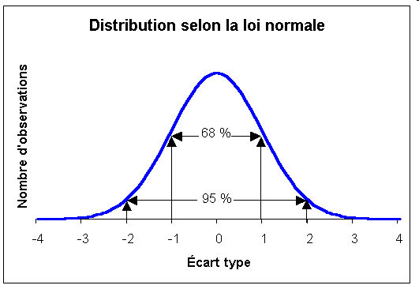
```
]]

<div class="my-footer"><span>Géodata Paris - Licence Pro `r annee` : analyse de données - Florian Bayer</span></div> 

---
class: animated, fadeIn
## La loi normale : exemple

.center-img[
```{r echo=FALSE, out.width="100%"}
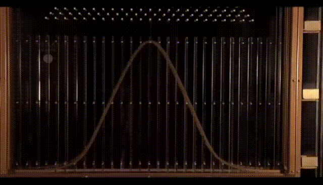
```
]

<div class="my-footer"><span>Géodata Paris - Licence Pro `r annee` : analyse de données - Florian Bayer</span></div> 


---
class: animated, fadeIn
## Ecart-type

.pull-left1[
```{r echo=FALSE, out.width="100%"}

df.var <- data.frame("Etudiants" = c("A","B","C","D","E","F","G","H","I","Total","Moyenne"),
                      "Xi" = c(7,8,9,10,10,10,11,12,13,90,10),
                      "variance" = c(9,4,1,0,0,0,1,4,9,28,"28/9=3,11"))

df.var <- df.var %>% dplyr::rename("Etudiants i"  = Etudiants, "(Xi-Xmoy)²" = variance)

df.var %>%
  kable() %>%
  kable_styling(bootstrap_options = "striped", full_width = F,font_size = 18) %>%
  row_spec(10:11, bold = T, color = "white", background = "#01326E")

```
]

.pull-right3[
La variance est de 3.11, on en déduit la valeur de l'écart-type ( $\sqrt{3.11}=1.8$ ). Elle est considérée comme une mesure de l'ordre de grandeur de la dispersion des notes autour de la moyenne. 

Si la distribution des notes du Pr X était gaussienne (ce qui est difficile à affirmer au vu de la faiblesse de l'échantillon) on
devrait trouver :
- environ deux tiers des notes dans l'intervalle [8.2 ; 11.8] qui correspond à la moyenne plus ou moins un écart-type
- 95% des notes dans l'intervalle [6.4 ; 13.6] qui correspond à la moyenne plus ou moins deux écarts-type.

Le même calcul effectué sur les notes du Pr Y aboutit à un écart-type de **5.3** qui est beaucoup plus importante que celui des notes du professeur X. Les notes du Pr Y sont **beaucoup plus dispersées** que celles du Pr X. (Claude Grasland)
]


<div class="my-footer"><span>Géodata Paris - Licence Pro `r annee` : analyse de données - Florian Bayer</span></div> 


---
class: animated, fadeIn
## Ecart-type : illustration graphique

.center-img[
```{r echo=FALSE, out.width="100%"}
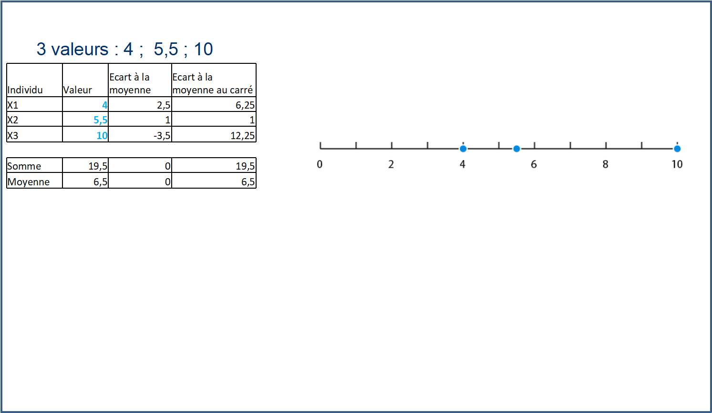
```
]

<div class="my-footer"><span>Géodata Paris - Licence Pro `r annee` : analyse de données - Florian Bayer</span></div> 

---
class: animated, fadeIn
## Ecart-type : illustration graphique

.center-img[
```{r echo=FALSE, out.width="100%"}
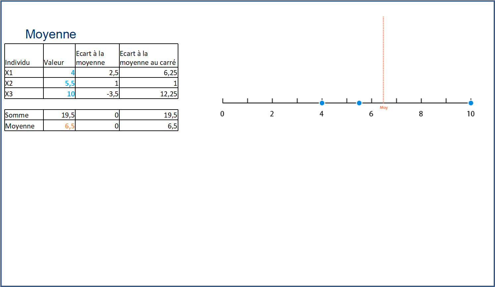
```
]

<div class="my-footer"><span>Géodata Paris - Licence Pro `r annee` : analyse de données - Florian Bayer</span></div> 

---
class: animated, fadeIn
## Ecart-type : illustration graphique

.center-img[
```{r echo=FALSE, out.width="100%"}
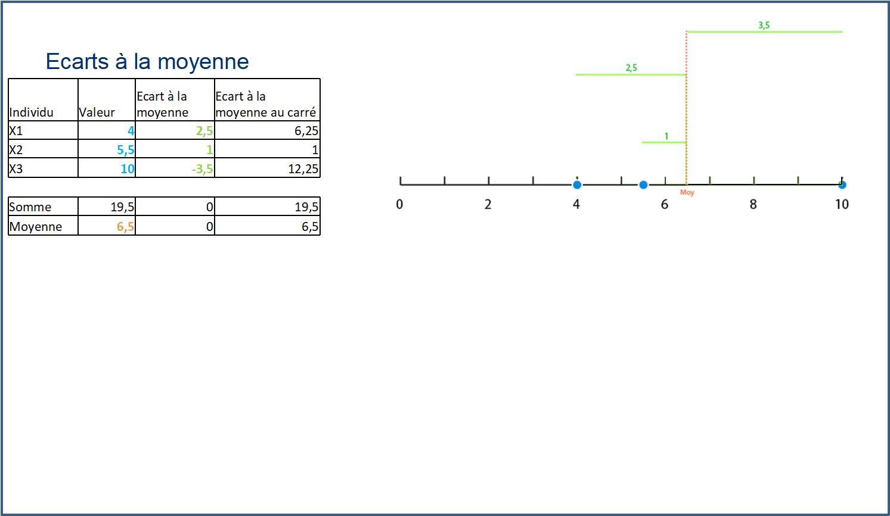
```
]

<div class="my-footer"><span>Géodata Paris - Licence Pro `r annee` : analyse de données - Florian Bayer</span></div> 

---
class: animated, fadeIn
## Ecart-type : illustration graphique

.center-img[
```{r echo=FALSE, out.width="100%"}
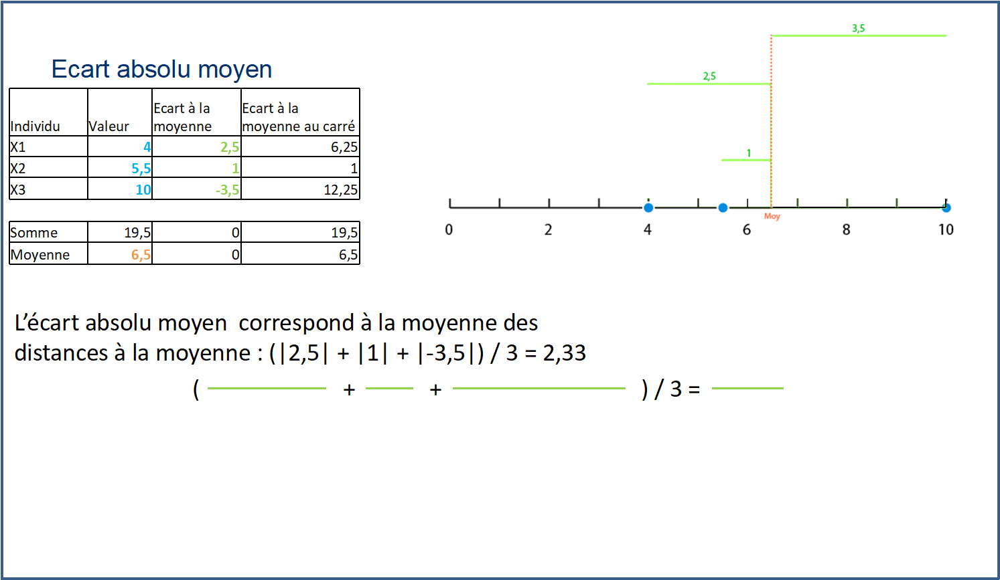
```
]

<div class="my-footer"><span>Géodata Paris - Licence Pro `r annee` : analyse de données - Florian Bayer</span></div> 

---
class: animated, fadeIn
## Ecart-type : illustration graphique

.center-img[
```{r echo=FALSE, out.width="100%"}
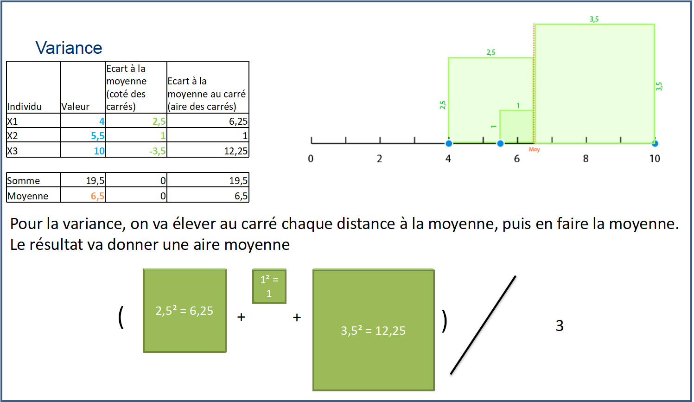
```
]

<div class="my-footer"><span>Géodata Paris - Licence Pro `r annee` : analyse de données - Florian Bayer</span></div> 

---
class: animated, fadeIn
## Ecart-type : illustration graphique

.center-img[
```{r echo=FALSE, out.width="100%"}
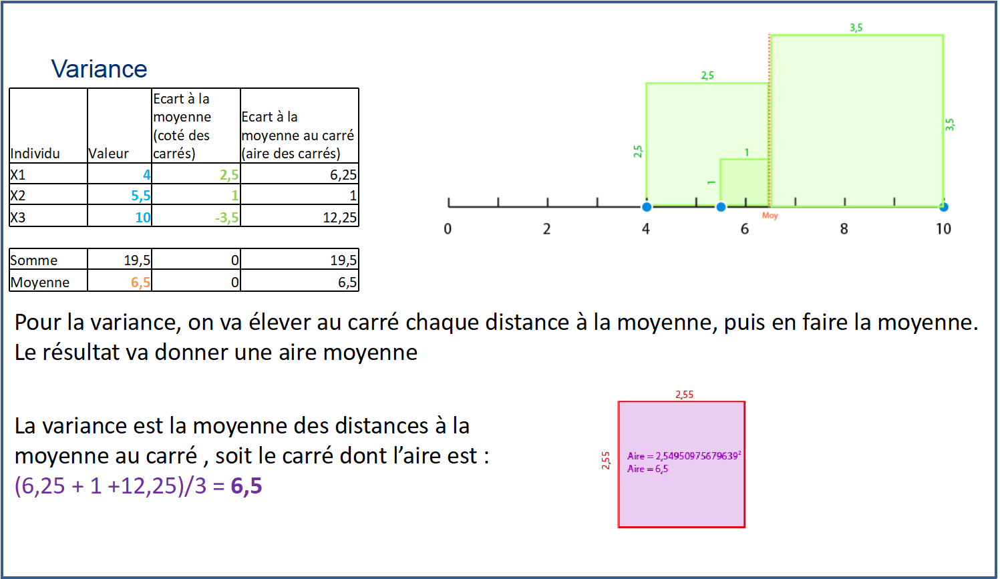
```
]

<div class="my-footer"><span>Géodata Paris - Licence Pro `r annee` : analyse de données - Florian Bayer</span></div> 

---
class: animated, fadeIn
## Ecart-type : illustration graphique

.center-img[
```{r echo=FALSE, out.width="100%"}
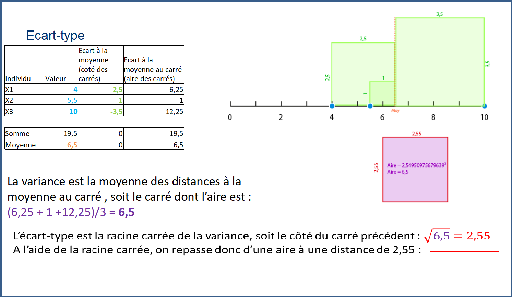
```
]

<div class="my-footer"><span>Géodata Paris - Licence Pro `r annee` : analyse de données - Florian Bayer</span></div> 

---
class: animated, fadeIn
## Ecart-type : interprétation

La variance s’interprète donc comme une surface : 
- plus elle est grande, plus il y a de dispersion loin de la moyenne.

Puisque l’écart-type est la racine carrée de la variance, on passe d’une interprétation de **surface** pour la variance (les carrés de l’exemple précédent) à une interprétation de **distance** pour l’écart-type (on passe de deux à une dimension). 

Il s’interprète alors comme une moyenne des distances à la moyenne. **Ces « distances » sont mesurées à la « Pythagore »** : une racine
carrée des différences au carré .

L’écart-type a l’avantage d’être exprimé dans la même unité de mesure que la variable de départ.

<div class="my-footer"><span>Géodata Paris - Licence Pro `r annee` : analyse de données - Florian Bayer</span></div> 

---
class: animated, fadeIn
## Les paramètres de dispersion relatifs

Les paramètres de dispersion absolus ne permettent pas de comparer des séries statistiques de natures différentes. Dans ce cas il faut utiliser des paramètres de dispersion relatifs :
- Pas d’effet de taille.
- Indépendamment de l’unité de mesure.

Le plus utilisé est le coefficient de variation (CV). Il peut être exprimé en %. Plus la valeur du coefficient de variation est élevée, plus la dispersion autour de la moyenne est grande.
- CV = Ecart-type / moyenne

<div class="my-footer"><span>Géodata Paris - Licence Pro `r annee` : analyse de données - Florian Bayer</span></div> 


---
class: inverse, center, middle, animated, fadeIn  
# 2.3 - Autres outils de l'analyse univariée

<div class="my-footer-title "></div> 


---
class: animated, fadeIn
## Médiane et quantile

la médiane est souvent associée dans les analyses univariées aux **quantiles** :
- Les valeurs qui définissent les bornes d'une partition en **classes d'effectifs égaux**. 
- Il y aura le **même nombre d’éléments** dans chaque classe.
- Mais cette approche ne permet pas de voir les outliers si le nombre de classes est faible.

Pour des quartiles (4 classes), on note Min, Q1, Q2, Q3, Max. 

Entre Min et Q1, on a  25% de la fréquence des effectifs de la série, les 25% suivants entre Q1 et Q2, 25% suivants entre Q2 et Q3, même chose entre Q3 et Max. A noter que Q2 est ici la médiane.

.center-img[
```{r echo=FALSE, out.width="90%"}
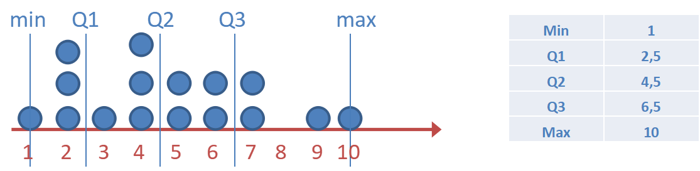
```
] 

<div class="my-footer"><span>Géodata Paris - Licence Pro `r annee` : analyse de données - Florian Bayer</span></div> 

---
class: animated, fadeIn
## L’intervalle interquartile

Comme pour la moyenne avec l'écart-type, il existe un paramètre de dispersion associé à la médiane : l'intervalle interquartile.
- Basé sur les quantiles 
- Pour avoir un paramètre de dispersion, on calcule l'intervalle interquartile : on conserve 50 % des valeurs les plus proches de la médiane, c’est-à-dire la différence entre Q3 et Q1.
- L’intervalle interdéciles est également utilisé (on conserve 80 % des valeurs).
- Fréquemment utilisé pour les distributions non symétrique (et non normale)

Pour obtenir un paramètre de dispersion relatif, on peut calculer le coefficient interquartile (CI) :
- CI = (Q3-Q1)/Q2

<div class="my-footer"><span>Géodata Paris - Licence Pro `r annee` : analyse de données - Florian Bayer</span></div> 

---
class: animated, fadeIn
## Les boxplots

.pull-left[
.font90[
L’utilisation des quantiles permet une autre représentation graphique d’une série quantitative : **la boite à moustache (boxplot)**.

Elle consiste à mettre sur un graphique les valeurs des quantiles, le plus souvent des quartiles.

Par défaut, de nombreux boxplots n’affichent pas le min et le max mais 1,5x l’intervalle interquartile (IQR,soit les valeurs comprises entre Q1 et Q3 = 50% des valeurs autours de la médiane). Cette méthode permet de couvrir 99,3% de la série.

Les valeurs restantes sont appelées **outliers** et correspondent aux valeurs extrêmes min et max.
]]
.pull-right[.center-img[
```{r echo=FALSE, out.width="100%"}
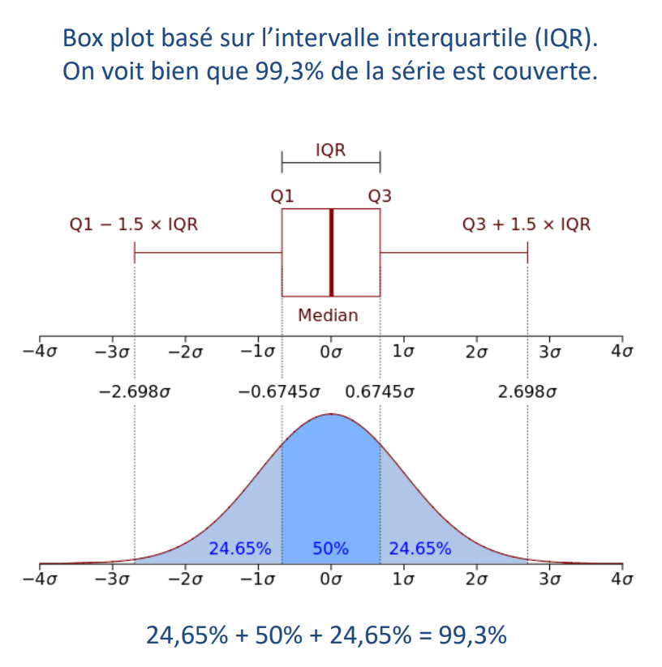
```
]]

<div class="my-footer"><span>Géodata Paris - Licence Pro `r annee` : analyse de données - Florian Bayer</span></div> 

---
class: animated, fadeIn
## Les boxplots : exemple

.pull-left[
```{r echo=FALSE, out.width="100%"}

p <- ggplot(meteo, aes(x=ville,y=temperature, color= ville))+
  geom_boxplot() + ggtitle("Températures quotidiennes en 2024") +
  xlab("") + ylab("Température °C") + theme(legend.position="none")

# frameWidget(ggplotly(p), width='100%', height='100%') 
p

```

]

.pull-right[
La comparaison des distributions et de leur forme est très facile avec le box plot (ici en 1,5x l’intervalle interquartile, on le reconnait aux outliers -valeurs hors norme- en forme de points).  

L’avantage des box plots est qu’ils sont construits de manière **objective** (quartile). C’est-à-dire que la seule intervention du concepteur sur le graphique est le choix de cette méthode de représentation…
]

<div class="my-footer"><span>Géodata Paris - Licence Pro `r annee` : analyse de données - Florian Bayer</span></div> 

---
class: animated, fadeIn
## Le Quantile-Quantile Plot :  qq-plot

Certains logiciels de statistiques vous permettent de créer un QQPLOT, idéal pour montrer la normalité d'une série : 

.pull-left[
```{r echo=FALSE, out.width="100%", fig.width=8,fig.height=8}

set.seed(5432)                   # Set seed for reproducibility
x <- rnorm(10000)  
data <- data.frame(x) 

ggplot(data, aes(sample = x)) +  # Create QQplot with ggplot2 package
  stat_qq() +
  stat_qq_line(col = "red") + 
  ggtitle("Les mesures (points) s'alignent sur la droite rouge",
          subtitle = "les données suivent une loi normale")+
  xlab("") + ylab("")+
  theme(aspect.ratio = 1,
        plot.title = element_text(size = 14, face = "bold"),
        plot.subtitle = element_text(size = 14))

```

]

.pull-right[
```{r echo=FALSE, out.width="100%", fig.width=8,fig.height=8}

set.seed(5432)                   # Set seed for reproducibility
y <- rlogis(10000)  
data <- data.frame(y) 

ggplot(data, aes(sample = y)) +  # Create QQplot with ggplot2 package
  stat_qq() +
  stat_qq_line(col = "red") + 
  ggtitle("Les mesures ne s'alignent sur la droite rouge",
          subtitle = "les données ne suivent pas une loi normale")+
  xlab("") + ylab("")+
  theme(aspect.ratio = 1,
        plot.title = element_text(size = 14, face = "bold"),
        plot.subtitle = element_text(size = 14))

```

]

<div class="my-footer"><span>Géodata Paris - Licence Pro `r annee` : analyse de données - Florian Bayer</span></div>

---
class: animated, fadeIn
## Mesure de la symétrie

.pull-left[
La plupart des outils statistiques, dont Excel, donnent un indicateur appelé coefficient d’asymétrie (Skew). Il s’agit d’une mesure standardisée de l’étalement de la queue de distribution.
- S’il est égal ou très proche de 0 : symétrie
- Plus il s'éloigne de 0 positivement, plus la série est étirée à droite
- Plus il s'éloigne de 0 négativement plus la série est étirée à gauche

Il est de nouveau préférable de confirmer cet indicateur graphiquement.

]

.pull-right[ .center-img[
```{r echo=FALSE, out.width="75%"}
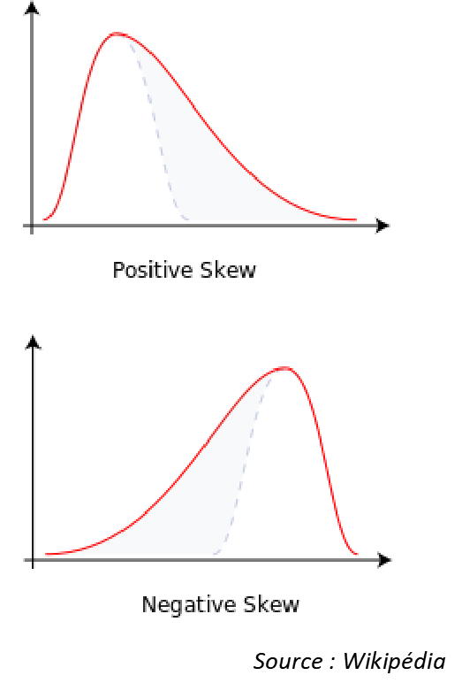
```
] ]

<div class="my-footer"><span>Géodata Paris - Licence Pro `r annee` : analyse de données - Florian Bayer</span></div>

---
class: animated, fadeIn
## Mesure de l'aplatissement

.pull-left[
On associe souvent au coefficient d’asymétrie un second indicateur : **le kurtosis** qui permet de mesurer l’aplatissement d’une distribution.

L’interprétation combinée des deux indicateurs permet de justifier factuellement la loi de probabilité d’une série. Par exemple pour justifier qu’une série s’approche d’une loi normale. 

Attention, le kurtosis d’une loi normale est normalement égale à 3, mais pour des raisons pratiques on soustrait 3 au résultats du calcul (kurtosis normalisé). Excel et la plupart des outils de statistique fournissent un kurtosis normalisé.

]

.pull-right[ .center-img[
```{r echo=FALSE, out.width="100%"}
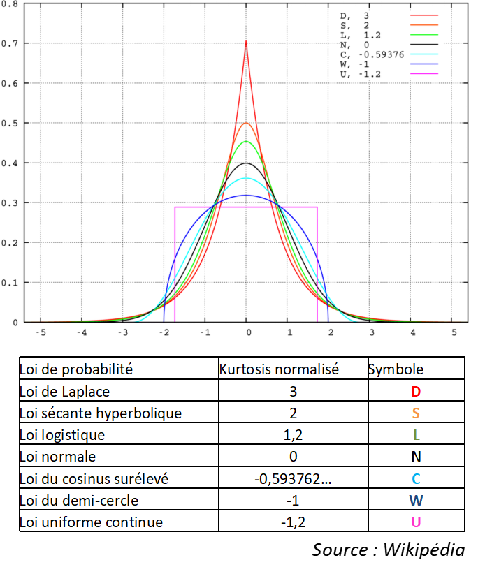
```
] ]

<div class="my-footer"><span>Géodata Paris - Licence Pro `r annee` : analyse de données - Florian Bayer</span></div>

---
class: animated, fadeIn
## Tests

Il existe également des tests statistiques pour déterminer si une série suit une loi normale. 

Pour la loi normale : 
- [le test de Shapiro-Wilk](https://www.statskingdom.com/shapiro-wilk-test-calculator.html). Si la p-value n'est pas significative (rejet de H0, généralement à 5%), vous données suivent une loi normale
- le test de Jarque-Bera (utilisé dans Arcgis)


<div class="my-footer"><span>Géodata Paris - Licence Pro `r annee` : analyse de données - Florian Bayer</span></div>


---
class: inverse, center, middle, animated, fadeIn  
# Conclusions

<div class="my-footer-title "></div> 

---
class: animated, fadeIn
## Concepts clés
<div class="my-footer"><span>Géodata Paris - Licence Pro `r annee` : analyse de données - Florian Bayer</span></div> 

L'analyse univariée d'une série statistique est essentielle pour comprendre le comportement des données.

Cette analyse se fait à l'aide de deux approches complémentaires :

- la représentation graphique, subjective mais qui donne des informations rapidement.
- Le calcul mathématique, objectif, qui fourni un résumé de la distribution (valeur centrale), des informations sur la dispersion des données (paramètres de dispersion) et sur la forme de la série (asymétrie, kurtosis).

Pour les graphiques :
- La représentation des données qualitatives se fait avec un diagramme en baton. Il faut souvent *dénombrer* les données à l'aide d'une tableau de contingence. 
- La représentation des données quantitatives se fait avec un histogramme ou un boxplot.

---
class: animated, fadeIn
## Concepts clés
<div class="my-footer"><span>Géodata Paris - Licence Pro `r annee` : analyse de données - Florian Bayer</span></div> 

Pour résumer une série, on utilise les valeurs centrales: 
- La moyenne est souvent rencontrée, mais est sensible aux outliers contrairement à la médiane.
- La médiane peut se combiner avec les quantiles, qui décrivent de manière objective la série. Ils peuvent néanmoins *cacher* les outliers.

Résumer une série avec une seule valeur centrale n'est pas suffisant. Il faut également mesurer sa variabilité à l'aide d'un paramètre de dispersion :
- à l'aide de l'écart-type, qui avec la moyenne possède une signification probabiliste pour les distributions qui suivent une loi normale.
- A l'aide de l'interval interquartile. 
- Ces paramètres de dispersion sont absolus : ils s'expriment dans la même unité que la série. Des paramètres de dispersion relatifs permettent de supprimer l'unité et donc de comparer des variabilités de différentes séries (coefficient de variation, coefficient interquartile)


---
class: animated, fadeIn
## Concepts clés
<div class="my-footer"><span>Géodata Paris - Licence Pro `r annee` : analyse de données - Florian Bayer</span></div> 

Il faut toujours avoir conscience que vos données reflètent une réalité :
- directement observable (un nombre d'habitants)
- ou calculée (une densité de population, soit le nombre d'habitants en supprimant l'effet de taille du maillage observé)

Attention, faire un graphique et donner le résultat d’un calcul n’est pas une plus-value : un logiciel de statistique peu le faire automatiquement. 

Ce sont vos capacités à les interpréter dans le contexte de votre étude qui priment !

