```{r setup, global_options,include=FALSE}
knitr::opts_chunk$set(
  dpi = 200,
  strip.white = T,
  message = FALSE,
  comment = NA,
  echo = FALSE,
  warning = FALSE,
  eval = TRUE
)
```

```{r include=FALSE}
source('./assets/functions.R')

# Les figures (cartes et graphiques Altair) sont issues de l'ancienne version
# notebook du cours (LPRO_Cours_3_disc.ipynb, retiré du dépôt) et exportées dans assets/images/7-disc
requiredPackages = c('knitr','dotenv')

PackageFacile(requiredPackages)

load_dot_env(".env")
annee = Sys.getenv("annee")

```


class: center, middle, inverse, title-slide, animated, fadeIn
# Analyse des données Licence Pro `r annee`
# Cours n°4- La discrétisation en cartographie<br /> <br />
### Florian Bayer

<div class="my-footer"><span>Géodata Paris - Licence Pro `r annee` : analyse de données - Florian Bayer</span></div>

---
class: inverse, center, middle, animated, fadeIn
# Objectifs du cours

.section-icon[<i class="fa-solid fa-person-chalkboard fa-fade"></i>]

<div class="my-footer-title "></div>

---
class: animated, fadeIn
## <i class="fa-solid fa-list-check"></i> Contenu de l'enseignement
<div class="my-footer"><span>Géodata Paris - Licence Pro `r annee` : analyse de données - Florian Bayer</span></div>

.cols[
.col[
.card[
.card-title[Un cours sur :]
- Les statistiques appliquées à la cartographie.
- Et les méthodes de discrétisation.
- Avec une séance de TD pour appliquer les acquis
]
]
.col[
.card[
.card-title[Dans le détail :]
- Principes de la discrétisation en cartographie : pourquoi et quand discrétiser ?
- Traiter l'information statistique de manière simple, pour l'adapter au message cartographique
- Discrétiser en fonction des besoins et de la forme de la série.
- Choisir le nombre de classes.
- Comment comparer des cartes avec les mêmes unités.
- Ou avec des unités différentes.
- Transformer si besoin les séries
]
]
]

---
class: inverse, center, middle, animated, fadeIn
# Concepts et outils utilisés dans cet enseignement

.section-icon[<i class="fa-solid fa-brain fa-fade"></i>]

<div class="my-footer-title "></div>

---
class: animated, fadeIn
## <i class="fa-solid fa-sitemap"></i> Schéma de production cartographique
<div class="my-footer"><span>Géodata Paris - Licence Pro `r annee` : analyse de données - Florian Bayer</span></div>

<br />

.center-img[
```{r echo=FALSE, out.width="100%"}
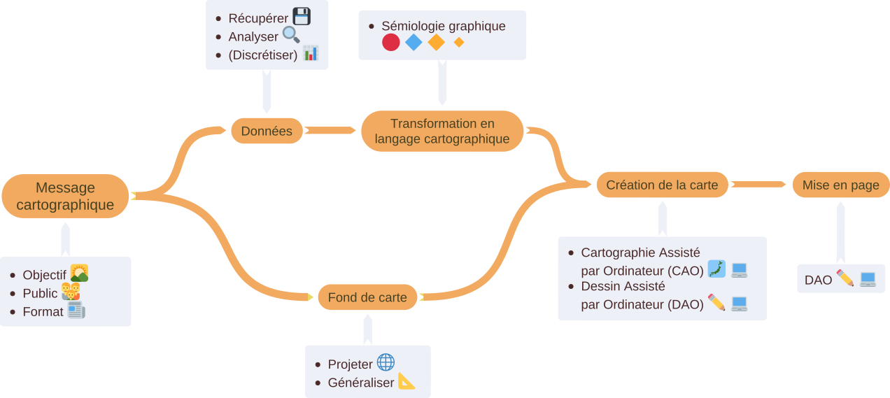
```
]

---
class: animated, fadeIn
## <i class="fa-solid fa-magnifying-glass-location"></i> Cartographier pour étudier la variabilité spatiale
<div class="my-footer"><span>Géodata Paris - Licence Pro `r annee` : analyse de données - Florian Bayer</span></div>

.center-img[
```{r echo=FALSE, out.width="100%"}
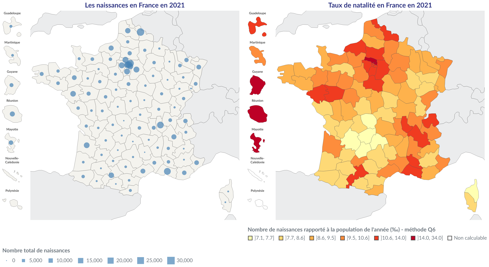
```
]

---
class: animated, fadeIn
## <i class="fa-solid fa-gears"></i> En étant attentif aux "sens" de vos indicateurs
<div class="my-footer"><span>Géodata Paris - Licence Pro `r annee` : analyse de données - Florian Bayer</span></div>

.center-img[
```{r echo=FALSE, out.width="100%"}
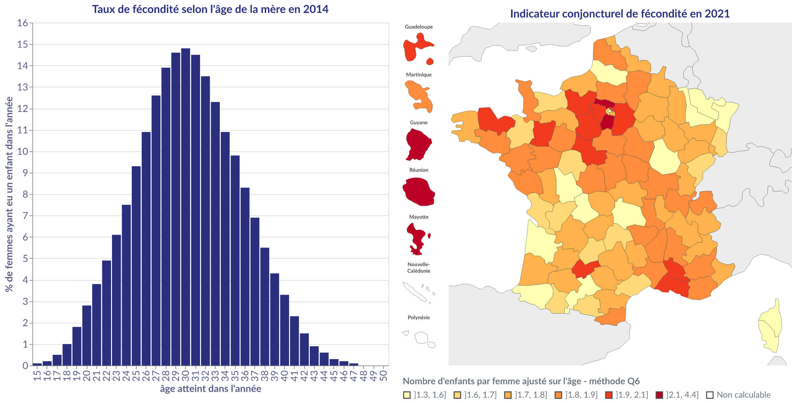
```
]

---
class: animated, fadeIn
## <i class="fa-solid fa-chart-column"></i> La discrétisation
<div class="my-footer"><span>Géodata Paris - Licence Pro `r annee` : analyse de données - Florian Bayer</span></div>

.cols[
.col[
.card[
.card-title[En cartographie et en statistique, il est parfois nécessaire de simplifier l'information à transmettre.]
- Notamment lorsque la quantité d'information à représenter est très importante.
- La réduction de l'information au sein de classes est appelée la discrétisation.
]
]
.col[
.card[
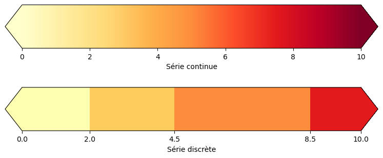
]
]
]

.definition[
Réduire l'information en transformant des données continues ou déjà discrètes en classes d'intervalles distinctes, couvrant l'ensemble de la série statistique initiale
]

---
class: animated, fadeIn
## <i class="fa-solid fa-circle-question"></i> Pourquoi discrétiser ?
<div class="my-footer"><span>Géodata Paris - Licence Pro `r annee` : analyse de données - Florian Bayer</span></div>

.center-img[
```{r echo=FALSE, out.width="82%"}
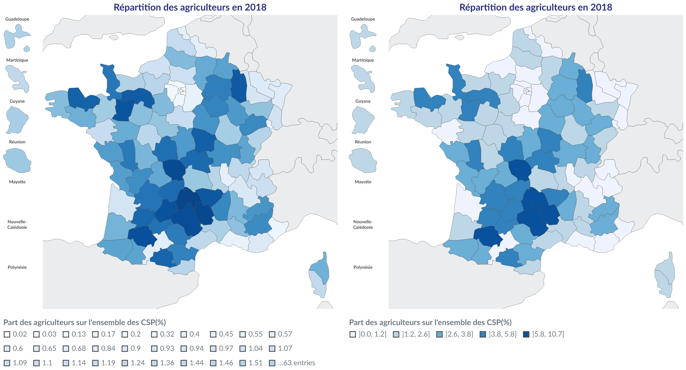
```
]

.font90[
L'œil humain n'est pas en mesure d'associer un chiffre précis à la variable visuelle valeur (à l'inverse de la taille+forme). Seule la notion d'ordre est "innée" avec le rapport de noir et blanc sur une surface donnée.

Pour avoir associée à un niveau de gris un chiffre, il faut donc discrétiser
]

---
class: animated, fadeIn
## <i class="fa-solid fa-scale-unbalanced"></i> Minimiser la variance intra-classe, maximiser la variance inter-classe (1)
<div class="my-footer"><span>Géodata Paris - Licence Pro `r annee` : analyse de données - Florian Bayer</span></div>

.center-img[
```{r echo=FALSE, out.width="88%"}
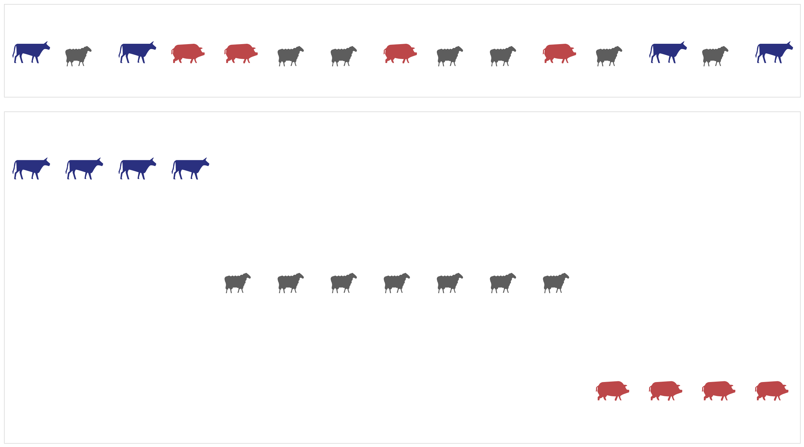
```
]

---
class: animated, fadeIn
## <i class="fa-solid fa-scale-unbalanced"></i> Minimiser la variance intra-classe, maximiser la variance inter-classe (2)
<div class="my-footer"><span>Géodata Paris - Licence Pro `r annee` : analyse de données - Florian Bayer</span></div>

.center-img[
```{r echo=FALSE, out.width="88%"}
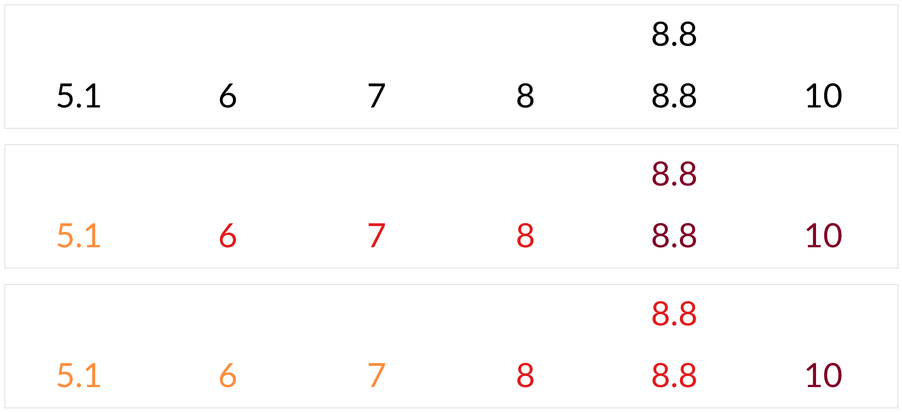
```
]

---
class: animated, fadeIn
## <i class="fa-solid fa-person-circle-question"></i> Une étape plus complexe qu'il n'y paraît
<div class="my-footer"><span>Géodata Paris - Licence Pro `r annee` : analyse de données - Florian Bayer</span></div>

.font90[
Le rôle du cartographe est de déterminer en amont de la production cartographique la **"meilleur" discrétisation**. Pour cela, il faut :

.cols[
.col[
.card[
.card-title[Se poser les questions :]
- faut-il mettre en avant la répartition spatiale la plus conforme à la répartition statistique ?
- Ma carte sera-t-elle **comparée** à une autre ?
- Dans le temps ?
- Avec des données de même nature ?
- Est-ce que mon **public** à besoin d'une discrétisation "simple", quitte à perdre une partie de l'information statistique.
]
]
.col[
.card[
.card-title[Analyser la distribution statistique]
- En la résumant par les valeurs centrales.
- Puis par les paramètres de dispersion.
- En fonction des interprétations, la méthode de discrétisation peut-être **choisie et justifiée**.
]
]
]

L'analyse univariée permet alors de visualiser les spécificités de la série (mode, symétrie, valeurs extrêmes...) ainsi que le résumé et la dispersion des données.
]

---
class: inverse, center, middle, animated, fadeIn
# Le message cartographique

.section-icon[<i class="fa-solid fa-comments fa-fade"></i>]

<div class="my-footer-title "></div>

---
class: animated, fadeIn
## <i class="fa-solid fa-lightbulb"></i> Concepts-clés de la cartographie
<div class="my-footer"><span>Géodata Paris - Licence Pro `r annee` : analyse de données - Florian Bayer</span></div>

.cols[
.col[
.card[
.card-title[La carte communique une information par l'image]
- Elle utilise un langage conceptualisé par Jacques Bertin, la sémiologie graphique : alphabet, vocabulaire et syntaxe
- Des biais cognitifs interviendront dans la conception de la carte (vision du cartographe sur ce qu'il observe).
]
]
.col[
.card[
.card-title[Pour réduire ces biais et rendre votre message efficace, il faut :]
- Utiliser les règles de la conception cartographique
- Penser la carte pour son public et non pour soi
- Adapter le message cartographique (public, support, objectifs).
]
]
]

---
class: animated, fadeIn
## <i class="fa-solid fa-person-circle-question"></i> Avant de faire une carte
<div class="my-footer"><span>Géodata Paris - Licence Pro `r annee` : analyse de données - Florian Bayer</span></div>

Identifier :

.cols[
.col[
.card[
.card-title[l'objectif de votre carte]
- Dois-je faire une carte pour y répondre ?
- Dans quel contexte ? (Explorer ? Communiquer ?)
- Quel est le message à faire passer ?
]
]
.col[
.card[
.card-title[le public de votre carte]
- Des experts sur le sujet ?
- Des novices ?
]
]
.col[
.card[
.card-title[le support de la carte]
- Papier ? Informatique ?
- Couleur ? Noir et blanc ?
]
]
]

Ensuite, vous pouvez identifier les informations à utiliser

Les règles de représentation des données en découleront et la discrétisation sera à adapter

---
class: animated, fadeIn
## <i class="fa-solid fa-message"></i> Le message cartographique
<div class="my-footer"><span>Géodata Paris - Licence Pro `r annee` : analyse de données - Florian Bayer</span></div>

Le message cartographique guide l'ensemble de la production d'une carte.

Il faut toujours avoir conscience des points suivants :

- La carte n'est pas faite pour son auteur mais pour ses **lecteurs**.
- Il faut **adapter son message** aux types de lecteurs et au support de la carte.
- La carte doit être **simple et efficace** au niveau du rendu (pas dans sa conception).
- Le lecteur doit fournir un **minimum d'effort** pour comprendre la carte dès le premier coups d'œil.
- Les cartes sont un ensemble de petits mensonges communément acceptés (pour simplifier la compréhension du message)
- La carte est un outil de **communication très puissant**. Son utilisation doit se faire de manière **honnête et objective**.

Cela passe par la bonne application des règles de la sémiologie graphique à l'ensemble de ces points Mais aussi dans certains cas un choix judicieux (rarement parfait) d'une discrétisation

---
class: animated, fadeIn
## <i class="fa-solid fa-meteor"></i> Impact de la discrétisation sur le message cartographique
<div class="my-footer"><span>Géodata Paris - Licence Pro `r annee` : analyse de données - Florian Bayer</span></div>

.center-img[
```{r echo=FALSE, out.width="100%"}
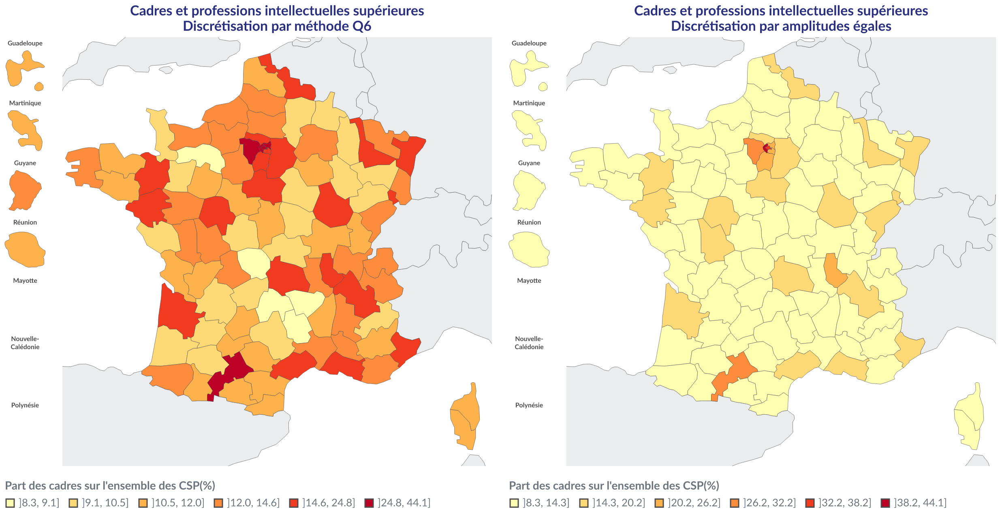
```
]

---
class: animated, fadeIn
## <i class="fa-solid fa-chart-area"></i> S'appuyer sur l'analyse univariée de la série
<div class="my-footer"><span>Géodata Paris - Licence Pro `r annee` : analyse de données - Florian Bayer</span></div>

Il est essentiel de comprendre **les caractéristiques de la distribution** de la ou des séries de données avec les outils de l'analyse univariée :

- Elle permet de faire un **compromis** entre information statistique, information géographique et la bonne transmission du message.
- Elle permet **résumer** l'information en conservant la forme de la distribution
- Elle permet si besoin de mettre en évidence les valeurs **remarquables** et de les faire apparaître sur la carte
- Elle donne les éléments **scientifiques** pour justifier et reproduire ses choix.

Dans le cas contraire, vous risquez d'avoir une carte n'apportant que très peu d'information, car la discrétisation sera mal adaptée au message cartographique

---
class: animated, fadeIn
## <i class="fa-solid fa-chart-area"></i> Suivre la forme de la distribution : exemple 1
<div class="my-footer"><span>Géodata Paris - Licence Pro `r annee` : analyse de données - Florian Bayer</span></div>

.center-img[
```{r echo=FALSE, out.width="100%"}
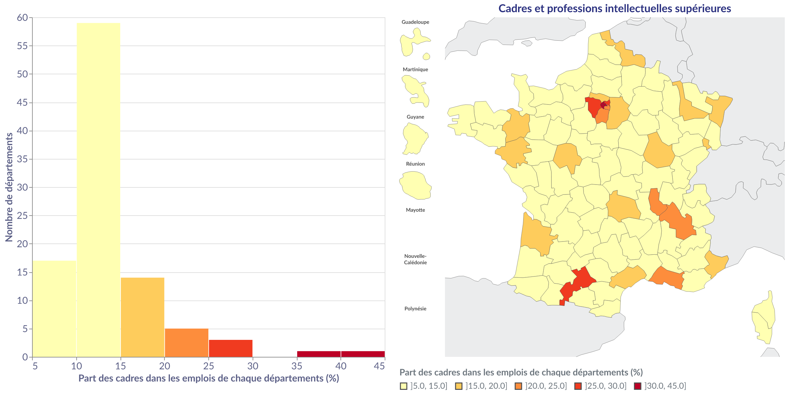
```
]

.note[Attention, il faudrait normalement que la première et la dernière classe soient regroupées sur l'histogramme]

---
class: animated, fadeIn
## <i class="fa-solid fa-chart-area"></i> Suivre la forme de la distribution : exemple 2
<div class="my-footer"><span>Géodata Paris - Licence Pro `r annee` : analyse de données - Florian Bayer</span></div>

.center-img[
```{r echo=FALSE, out.width="100%"}
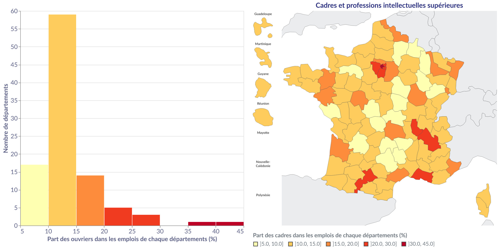
```
]

---
class: animated, fadeIn
## <i class="fa-solid fa-masks-theater"></i> Simple dans la pratique, mais...
<div class="my-footer"><span>Géodata Paris - Licence Pro `r annee` : analyse de données - Florian Bayer</span></div>

<br />

.cols[
.col-1[

]
.col-2[
.card[
.card-title[Certaines contraintes peuvent s'ajouter et complexifier la discrétisation]
- besoin de visualiser à un instant $t$ un phénomène (le plus simple).
- Besoin de comparer des données identiques à deux dates.
- Besoin de comparer des données différentes.
]
]
]

---
class: inverse, center, middle, animated, fadeIn
# Les méthodes de discrétisation

.section-icon[<i class="fa-solid fa-gear fa-spin"></i>]

<div class="my-footer-title "></div>

---
class: animated, fadeIn
## <i class="fa-solid fa-gavel"></i> Règles de discrétisation
<div class="my-footer"><span>Géodata Paris - Licence Pro `r annee` : analyse de données - Florian Bayer</span></div>

En cartographie, le découpage en classes d'une série de données suit les mêmes règles qu'en statistique :

- Les classes couvrent l'ensemble de la série statistique
- Elles sont contiguës
- Une valeur ne peut appartenir qu'à une seule classe
- Eviter si possible les classes vides

---
class: animated, fadeIn
## <i class="fa-solid fa-percent"></i> Les quantiles (effectifs égaux)
<div class="my-footer"><span>Géodata Paris - Licence Pro `r annee` : analyse de données - Florian Bayer</span></div>

**Concept** : même nombre d'individus dans chaque classe

**Construction** : nombre total d'individus (les départements) / nombre de classes souhaités

.cols[
.col[
.card.pro[
.card-title[Avantages :]
- Très facile à réaliser.
- Facilement compréhensible par le lecteur.
- Permet de comparer la position des individus géographiques dans différentes distributions (ordre de grandeur). Les bornes de classes ne seront pas les mêmes.
- Applicable à toutes les formes de distributions.
]
]
.col[
.card.con[
.card-title[Inconvénients :]
- Risque de perte d'information sur la forme de la distribution.
- Ne met pas forcément en évidence les valeurs extrêmes (max, min).
]
]
]

---
class: animated, fadeIn
## <i class="fa-solid fa-percent"></i> Les quantiles (effectifs égaux)
<div class="my-footer"><span>Géodata Paris - Licence Pro `r annee` : analyse de données - Florian Bayer</span></div>

.center-img[
```{r echo=FALSE, out.width="100%"}
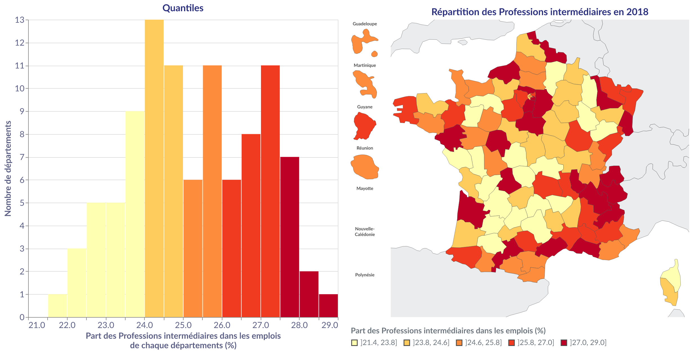
```
]

---
class: animated, fadeIn
## <i class="fa-solid fa-percent"></i> Les quantiles : variante Q6
<div class="my-footer"><span>Géodata Paris - Licence Pro `r annee` : analyse de données - Florian Bayer</span></div>

.font90[
**Concept** : Pour contourner le problème des valeurs extrêmes non mises en évidence avec les quantiles, Philcarto propose une méthode dite Q6. Ce sont des quartiles, mais la première classe contient les cinq pourcents valeurs les plus petites et non 25%, la dernière classe les cinq pourcents valeurs les plus fortes.

**Construction** : **&#91;Min : 5%&#91;** U &#91;5% ; 25%&#91; U &#91;25% ; 50%&#91; U &#91;50% ; 75 %&#91; U &#91;75% ; 95 %&#91; U **&#91;95% : max&#93;**

.cols[
.col[
.card.pro[
.card-title[Avantages :]
- Facile à réaliser (Quartiles ajustés).
- Mise en évidence des valeurs extrêmes.
- Permet de comparer la position des individus géographiques dans différentes distributions (ordre de grandeur). Les bornes de classes ne seront pas les mêmes.
- Applicable à toutes les formes de distributions.
]
]
.col[
.card.con[
.card-title[Inconvénients :]
- Risque de perte d'information sur la forme de la distribution (mais moins que pour des quantiles).
- Moins compréhensible par le lecteur que les quantiles (peu utilisées).
]
]
]
]

---
class: animated, fadeIn
## <i class="fa-solid fa-percent"></i> Les quantiles : variante Q6
<div class="my-footer"><span>Géodata Paris - Licence Pro `r annee` : analyse de données - Florian Bayer</span></div>

.center-img[
```{r echo=FALSE, out.width="100%"}
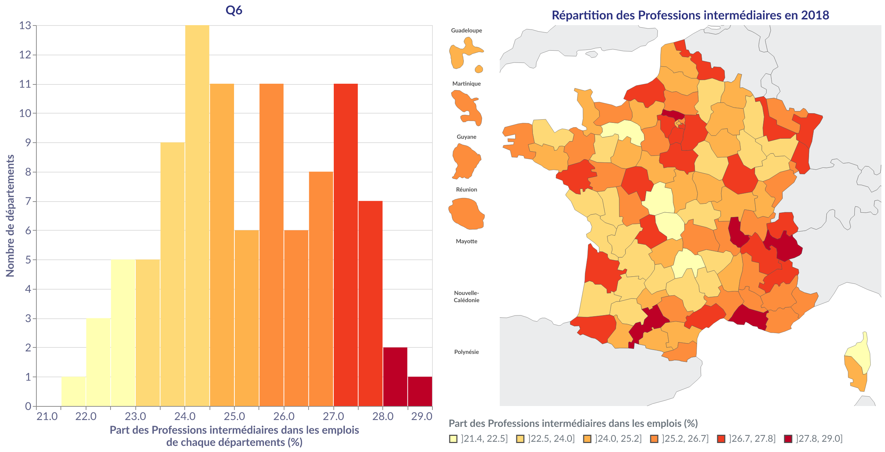
```
]

---
class: animated, fadeIn
## <i class="fa-solid fa-equals"></i> Les amplitudes égales
<div class="my-footer"><span>Géodata Paris - Licence Pro `r annee` : analyse de données - Florian Bayer</span></div>

**Concept** : Les classes ont la même étendue (de 10 en 10, de 5 en 5 etc.)

**Construction** : (max – min) / nombre de classes souhaités

.cols[
.col[
.card.pro[
.card-title[Avantages :]
- Très facile à réaliser.
- Facilement compréhensible par le lecteur.
- Efficace sur les distributions uniformes.
]
]
.col[
.card.con[
.card-title[Inconvénients :]
- Très mal adaptée à une distribution non uniforme.
- Succeptible de créer des classes vides.
]
]
]

---
class: animated, fadeIn
## <i class="fa-solid fa-equals"></i> Les amplitudes égales
<div class="my-footer"><span>Géodata Paris - Licence Pro `r annee` : analyse de données - Florian Bayer</span></div>

.center-img[
```{r echo=FALSE, out.width="100%"}
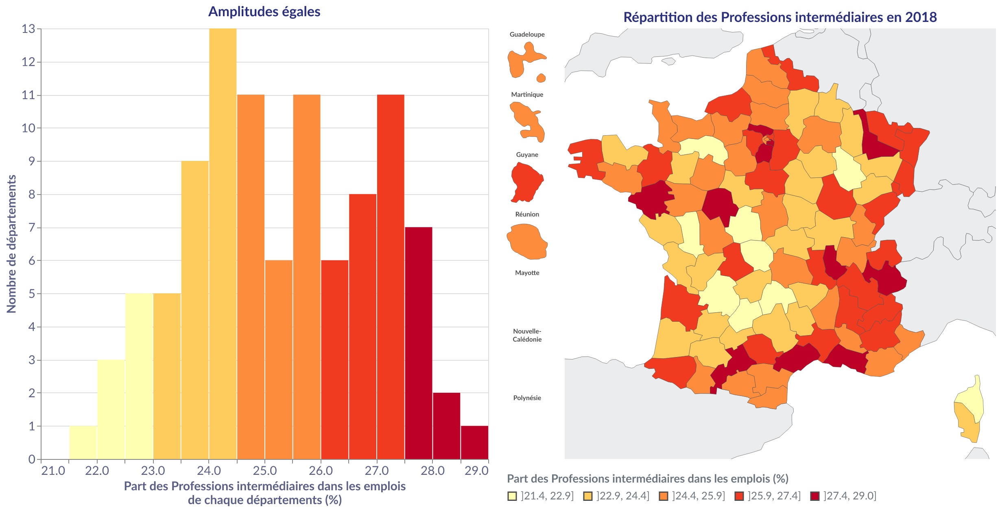
```
]

---
class: animated, fadeIn
## <i class="fa-solid fa-ranking-star"></i> La moyenne et l'écart-type
<div class="my-footer"><span>Géodata Paris - Licence Pro `r annee` : analyse de données - Florian Bayer</span></div>

.font90[
**Concept** : Les classes se basent sur les propriétés de la loi normale. La moyenne est de préférence au centre d'une classe. L'amplitude de la classe correspond à l'écart type (0,5 σ, 1 σ, 1,5 σ)

**Construction** : &#91;Min ; -1,5 σ&#91; U &#91;-1,5 ; -0,5 σ&#91; U &#91;-0,5 σ; +0,5 σ&#91; U &#91;+0,5 σ; +1,5 σ&#91; U &#91;+1,5, σ; Max&#93;

.cols[
.col[
.card.pro[
.card-title[Avantages :]
- A un sens sur les distribution gaussienne et permet dans ce cas un bon compromis géographique/statistique. Les classes extrêmes montrent les valeurs anormales, les classes centrales les valeurs proches de la normale.
- Facilement compréhensible par le lecteur initié.
- Permet la comparaison, si chaque série est gaussienne avec des moyennes et écart-type proches
]
]
.col[
.card.con[
.card-title[Inconvénients :]
- Difficile à comprendre pour le lecteur non initié (propriétés de la loi normale).
- Uniquement pour les distributions normales (transformation possible).
]
]
]
]

---
class: animated, fadeIn
## <i class="fa-solid fa-ranking-star"></i> La moyenne et l'écart-type
<div class="my-footer"><span>Géodata Paris - Licence Pro `r annee` : analyse de données - Florian Bayer</span></div>

.center-img[
```{r echo=FALSE, out.width="100%"}
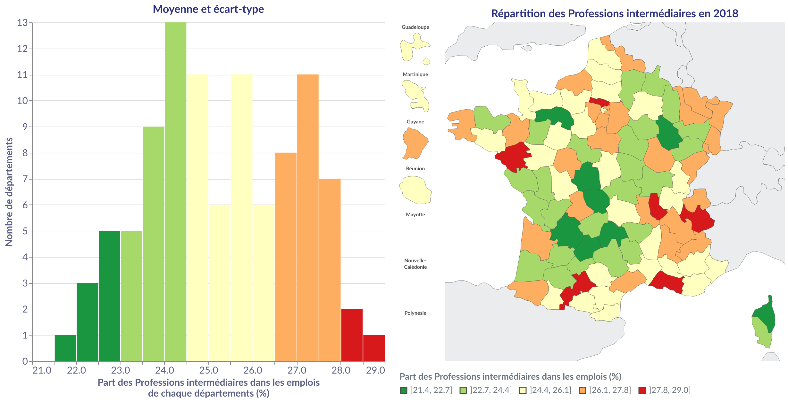
```
]

---
class: animated, fadeIn
## <i class="fa-solid fa-scale-unbalanced"></i> Algorithme de Jenks
<div class="my-footer"><span>Géodata Paris - Licence Pro `r annee` : analyse de données - Florian Bayer</span></div>

.font90[
**Concept** : les classes suivent au mieux la forme de la distribution, en regroupant les valeurs semblables et en isolant les valeurs extrêmes.

**Construction** : utilisation de l'algorithme de Jenks, qui minimise la variance intra-classe et maximise la variance inter-classe. Le cartographe peut "suivre" manuellement les coupures de l'histogramme, mais au prix d'une forte subjectivité (on parle de seuils naturels)

.cols[
.col[
.card.pro[
.card-title[Avantages :]
- Permet un excellent compromis entre la transmission de l'information et la conservation des caractéristiques de la distribution statistiques
- Les classes regroupent en leur sein les valeurs les plus semblables (minimise la variance intra-classe)
- et elles sont le plus différentes possibles les unes par rapport aux autres (maximise la variance inter-classe)
]
]
.col[
.card.con[
.card-title[Inconvénients :]
- Ne permet pas la comparaison de cartes si les bornes ne sont pas identiques.
- Subjectif pour les seuils naturels. Deux personnes travaillant sur la même série de données n'auront pas forcément les mêmes résultats.
]
]
]
]

---
class: animated, fadeIn
## <i class="fa-solid fa-scale-unbalanced"></i> Algorithme de Jenks
<div class="my-footer"><span>Géodata Paris - Licence Pro `r annee` : analyse de données - Florian Bayer</span></div>

.center-img[
```{r echo=FALSE, out.width="100%"}
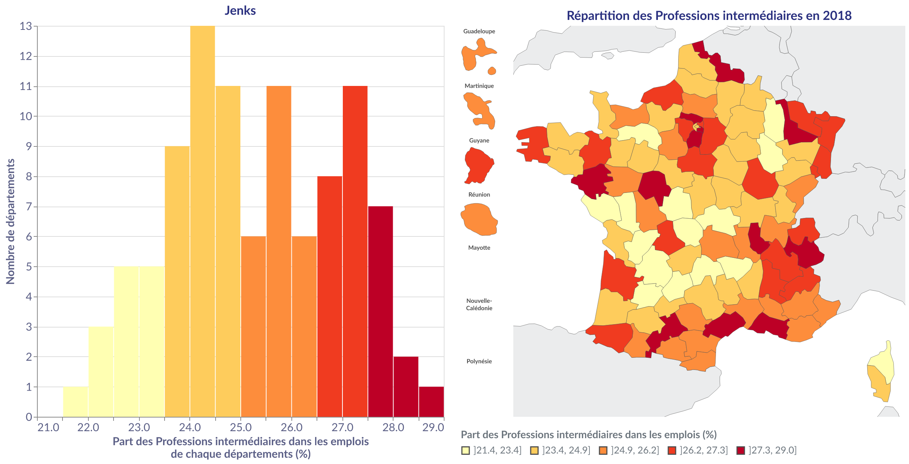
```
]

---
class: inverse, center, middle, animated, fadeIn
# Questions fréquentes

.section-icon[<i class="fa-solid fa-circle-question fa-fade"></i>]

<div class="my-footer-title "></div>

---
class: animated, fadeIn
## <i class="fa-solid fa-question"></i> Combien de classes ?
<div class="my-footer"><span>Géodata Paris - Licence Pro `r annee` : analyse de données - Florian Bayer</span></div>

.font90[
Pour les données de taux, la transmission du message est en grande partie liée à la discrétisation.

.cols[
.col[
.card[
.card-title[En cartographie, discrétiser une série statistique suppose donc un compromis entre :]
- La représentation et la transmission du message cartographique.
- Des biais cognitifs interviendront dans la conception de la carte (vision du cartographe sur ce qu'il observe).
]
]
.col[
.card[
.card-title[Ce qui conduit souvent à un nombre de classes en cartographie allant de 4 à 7]
- En dessous, l'information spatiale sera trop faible
- Au-delà, la carte sera trop complexe à comprendre : trop d'informations visuelles
- La longueur de la variable visuelle valeur ne permet pas à votre œil d'associer les différents niveaux de gris de la carte avec ceux de la légende.
]
]
]

Vous prendrez un minimum de risques avec une discrétisation en **5 classes**.
]

---
class: animated, fadeIn
## <i class="fa-solid fa-question"></i> Faut-il arrondir les valeurs des classes ?
<div class="my-footer"><span>Géodata Paris - Licence Pro `r annee` : analyse de données - Florian Bayer</span></div>

<br />

.card[
- A part en science physique, garder 10 chiffres après la virgule n'a pas trop d'intérêt
- Dans la plupart des cas, arrondissez à un chiffre après la virgule, deux au maximum selon l'indicateur
- Mais il faut arrondir en amont de la mise en page. Cela évitera qu'un individu se retrouve dans la mauvaise classe (dans un logiciel de cartographie, changer bornes de classes met à jour automatiquement le rendu. Ce n'est pas le cas d'un logiciel de dessin assisté par ordinateur)
]

---
class: animated, fadeIn
## <i class="fa-solid fa-code-compare"></i> Comment comparer des séries ?
<div class="my-footer"><span>Géodata Paris - Licence Pro `r annee` : analyse de données - Florian Bayer</span></div>

<br />

.cols[
.col[
.card[
.card-title[Soit comparer des données de même nature : comparaison absolue]
- Une même valeur (niveau de gris) est associée à un même interval de classe entre les cartes à comparer
- Les bornes de classes doivent donc être identiques
]
]
.col[
.card[
.card-title[Ou comparer des données de natures différentes : comparaison relative]
- On compare la fréquence des individus de chaque classe
- Une même valeur (niveau de gris) est associée à une même fréquence entre les cartes à comparer
- On fait donc en sorte que les effectifs de classes des différentes séries soient identiques
]
]
]

---
class: animated, fadeIn
## <i class="fa-solid fa-code-compare"></i> Comparaison absolue
<div class="my-footer"><span>Géodata Paris - Licence Pro `r annee` : analyse de données - Florian Bayer</span></div>

.font90[
Si on souhaite comparer des données identiques, une solution est de discrétiser avec des bornes de classes identiques entre les cartes : comparaison absolue.

Les même classes avec des bornes identiques et le même niveau de gris se retrouvent sur toutes les cartes

- Amplitude égale :
  - Calcul de l'amplitude de classe à partir des min et max de l'ensemble des séries
- Jenks :
  - Appliquer l'algorithme sur une des séries puis appliquer les bornes de classe calculées aux autres séries
- Tout autre méthode du moment que les bornes de classes soient identiques
  - Toutefois réapliquer des bornes calculées sur des quantiles ou une méthode basée sur la distribution n'a pas grand sens

N'oubliez pas d'ajuster le min et le max de chaque série. Il est également possible d'ajouter ou supprimer des classes si nécessaire
]

---
class: animated, fadeIn
## <i class="fa-solid fa-code-compare"></i> Comparaison absolue : exemple
<div class="my-footer"><span>Géodata Paris - Licence Pro `r annee` : analyse de données - Florian Bayer</span></div>

.center-img[
```{r echo=FALSE, out.width="78%"}
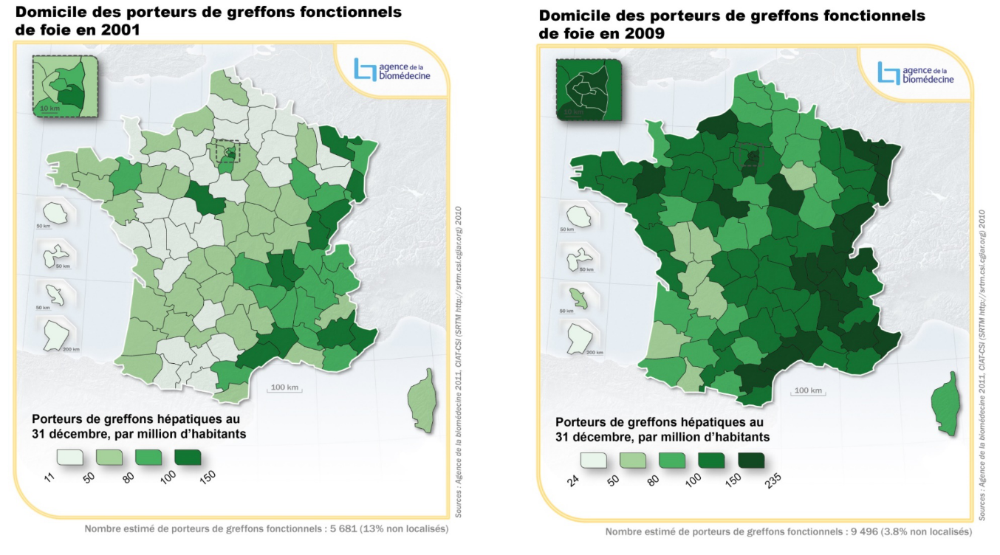
```
]

Dans cet exemple, une discrétisation Jenks a été appliquée sur les données 2001 puis retranscrites pour 2009 :

- En ajustant le minimum (11 vs 24)
- Et en ajoutant une classe supplémentaire pour 2009

---
class: animated, fadeIn
## <i class="fa-solid fa-code-compare"></i> Comparaison relative
<div class="my-footer"><span>Géodata Paris - Licence Pro `r annee` : analyse de données - Florian Bayer</span></div>

.font90[
Si on souhaite comparer des données différentes, les bornes de classes ne peuvent plus être identiques. On doit alors comparer la position relative des individus géographiques : comparaison relative

Les même classes avec des fréquences identiques et le même niveau de gris se retrouvent sur toutes les cartes

- Quantiles :
  - Vous comparer les individus appartenant à chaque n ième classe de la série A avec ceux de la même classe de la série B
- Q6 :
  - Même principe, sauf que les classes extrêmes contiennent chacune 5% des effectifs
- Moyenne et écart-type
  - Même répartition au sein de la loi normale. Attention, la moyenne et l'écart-type ne doivent pas être significativement différents entre les différentes séries à comparer

Il est évidemment possible d'utiliser une comparaison relative pour des données de même nature
]

---
class: animated, fadeIn
## <i class="fa-solid fa-code-compare"></i> Comparaison relative : exemple
<div class="my-footer"><span>Géodata Paris - Licence Pro `r annee` : analyse de données - Florian Bayer</span></div>

.font90[
Une discrétisation en quartile a été appliquée sur les deux séries de données :

- Les valeurs des bornes sont différentes
- Mais on peut comparer les 25% régions où le taux de sujets recensé est le plus faible V.S. les 25% des régions où les sujets prélevés sont les plus faibles. Idem pour chacune des classes.
]

.center-img[
```{r echo=FALSE, out.width="78%"}
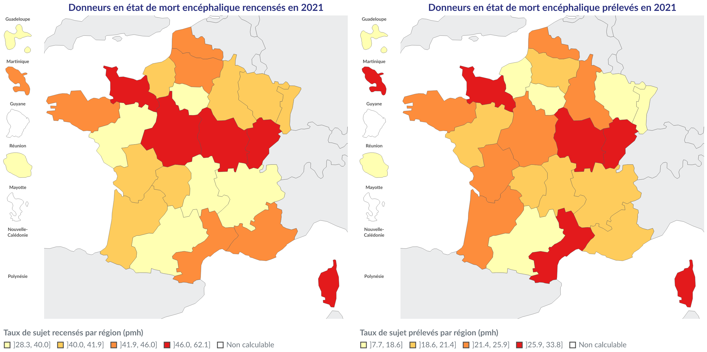
```
]

---
class: inverse, center, middle, animated, fadeIn
# Conclusion

.section-icon[<i class="fa-solid fa-arrows-to-circle fa-fade"></i>]

<div class="my-footer-title "></div>

---
class: animated, fadeIn
## <i class="fa-solid fa-key"></i> Concepts-clés (1)
<div class="my-footer"><span>Géodata Paris - Licence Pro `r annee` : analyse de données - Florian Bayer</span></div>

.font90[
La discrétisation des données de taux est obligatoire en cartographie. Il s'agit d'une limite physiologique, l'œil n'étant pas capable d'associer facilement à plusieurs valeurs de gris plusieurs données.

- On **réduit** donc l'information dans des classes pour que l'œil n'ait qu'un petit (4 à 7) nombre de niveaux de gris à analyser.
- Cette réduction implique une **simplification de l'information statistique**. Pour ne pas fausser le message cartographique, il faut veiller à utiliser une méthode adéquate.
- En s'intéressant au message cartographique (public, format, support).
- En décrivant la série grâce à l'analyse univariée (forme, résumé, dispersion, valeurs extrêmes).

De nombreuses méthodes de discrétisation existent et le choix final dépend évidemment des étapes précédentes.

N'oubliez pas que vous pouvez faire des ajustements manuels sur la discrétisation (bornes des classes) si cela est justifié : **soyez pragmatiques !**
]

---
class: animated, fadeIn
## <i class="fa-solid fa-key"></i> Concepts-clés (2)
<div class="my-footer"><span>Géodata Paris - Licence Pro `r annee` : analyse de données - Florian Bayer</span></div>

.font90[
Vous ne voulez pas que l'on vous accuse d'avoir manipulé la discrétisation ?

- Utilisez des quantiles (mais vous risquez de ne pas suivre la répartition statistique des données et d'avoir des classes hétérogènes).
- Q6 permet de conserver les extrêmes dans des classes à part.

<hr />

Vous ne souhaitez pas comparer votre carte à une autre et voulez suivre au mieux la forme de la distribution ?

- Utilisez les seuils naturels avec l'algorithme de Jenks
- mais vous ne pourrez pas comparer votre carte dans le temps sans ajustement car les bornes des classes des deux cartes seront différentes.

<hr />

Vous devez faire une carte pour le grand public ?

- Privilégiez les amplitudes égales avec si possible une amplitude arrondies (5 en 5, 100 en 100).
- Conservez néanmoins bien le vrai minimum et le vrai maximum.
]

---
class: animated, fadeIn
## <i class="fa-solid fa-key"></i> Concepts-clés (3)
<div class="my-footer"><span>Géodata Paris - Licence Pro `r annee` : analyse de données - Florian Bayer</span></div>

.font80[
Votre serie de données suit une loi normale et vous souhaitez montrer les individus géographiques « anormaux » ?

- Utilisez la discrétisation en moyenne écart-type.
- Vous pourrez ainsi mettre en évidence les n% individus en queues de distribution

<hr />

Vous voulez comparer des données de même nature ?

- Appliquez les amplitudes égales sur l'ensemble des séries, puis reportez les mêmes bornes de classe sur les cartes
- Une autre alternative est d'appliquer du Jenks sur l'une des séries et d'appliquer les mêmes bornes de classes sur les autres séries.
- Si la légende n'est pas commune, pensez à appliquer les vrais minimum et maximum.

<hr />

Vous voulez comparer des données de différentes natures ?

- Appliquez des quantiles/Q6 afin de pouvoir comparer les 20 premiers % individus (pour des quintiles) de la première série au 20 premiers % individus de la seconde série.
- Si vos deux séries sont normales (avec si possible des écart-types proches), vous pouvez aussi utiliser une discrétisation en moyenne écart-type.
]

---
class: animated, fadeIn
## <i class="fa-solid fa-flag-checkered"></i> En résumé
<div class="my-footer"><span>Géodata Paris - Licence Pro `r annee` : analyse de données - Florian Bayer</span></div>

La discrétisation des données de taux est obligatoire en cartographie. Il s'agit d'une limite physiologique, l'œil n'étant pas capable d'associer facilement à plusieurs valeurs de gris plusieurs données.

- On **réduit** donc l'information dans des classes pour que l'œil n'ait qu'un petit (4 à 7) nombre de niveaux de gris à analyser.
- Cette réduction implique une **simplification de l'information statistique**. Pour ne pas fausser le message cartographique, il faut veiller à **utiliser une méthode adéquate**.
- En s'intéressant au message cartographique (public, format, support)
- En décrivant la série grâce à l'analyse univariée (forme, résumé, dispersion, valeurs extrêmes).

<hr />

De nombreuses méthodes de discrétisation existent et le choix final dépend évidemment des étapes précédentes.

---
class: inverse, center, middle, animated, fadeIn
# Ne soyez pas prisonnier des statistiques. N'oubliez pas que vous pouvez faire des ajustements manuels sur la discrétisation si cela est justifié

.section-icon[Soyez pragmatiques !]

<div class="my-footer-title "></div>
