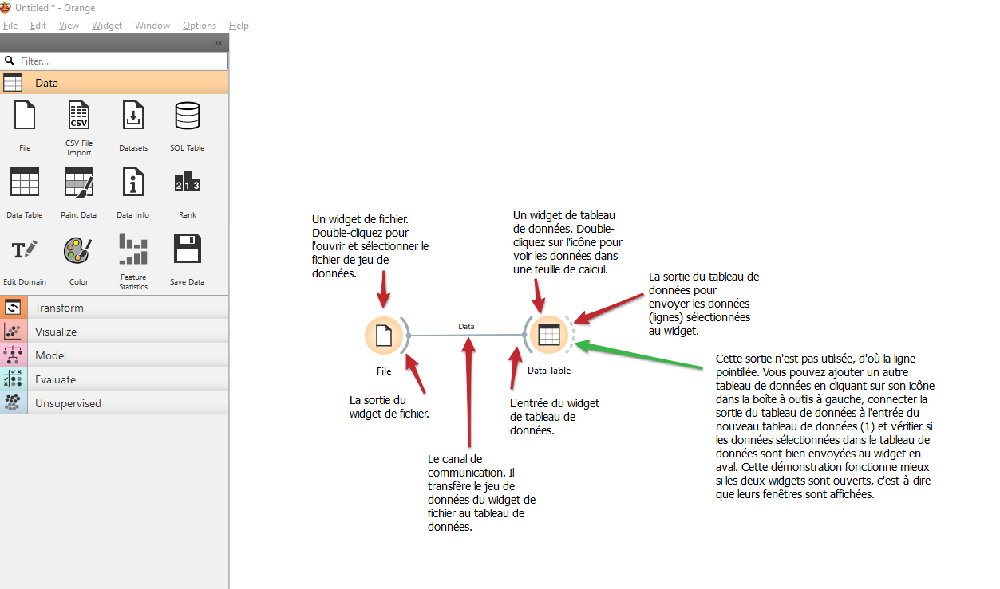
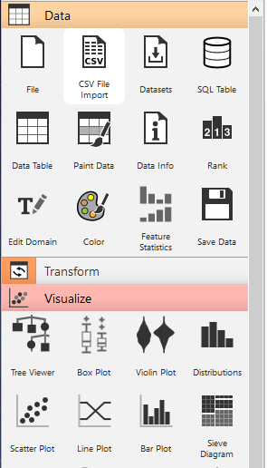
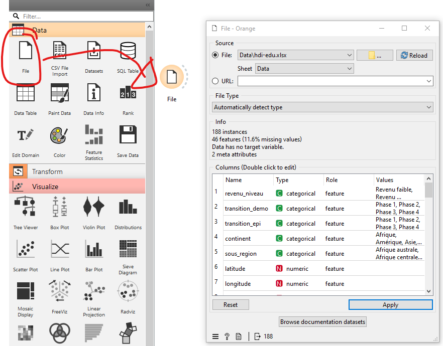
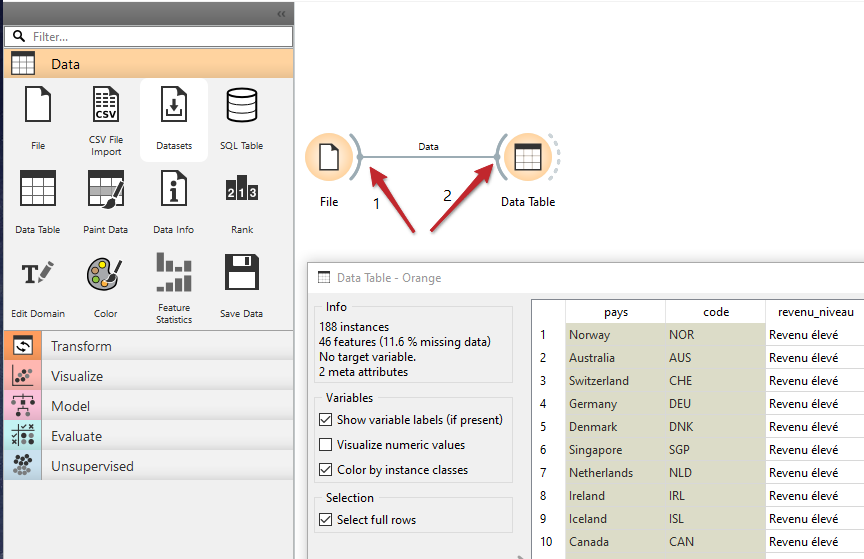
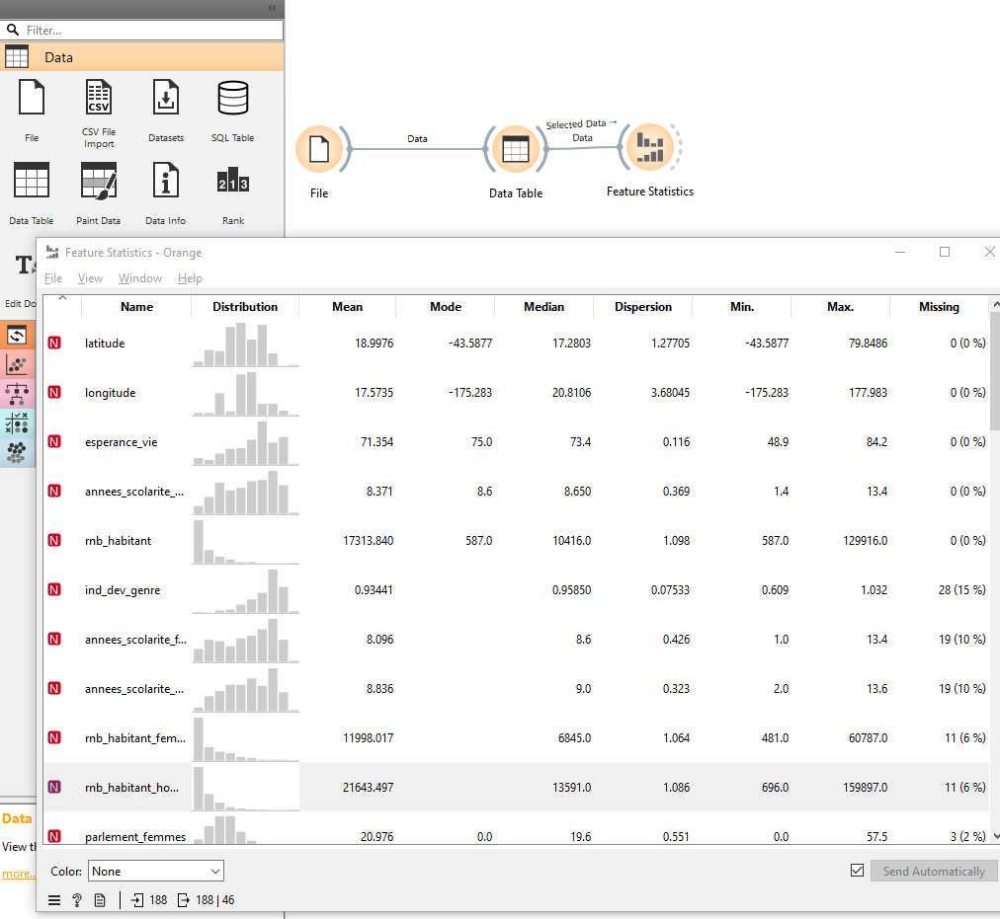
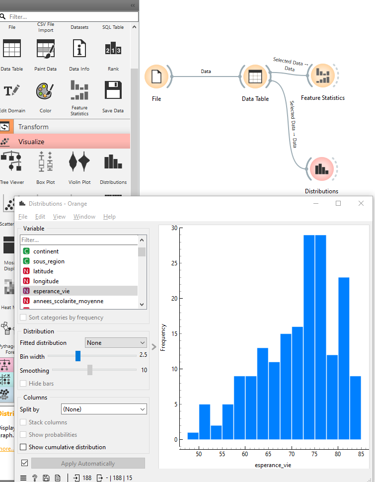
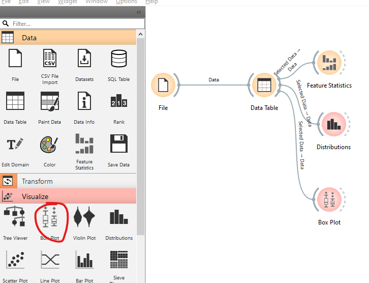

```{r setup, global_options,include=FALSE}
knitr::opts_chunk$set(
  dpi = 200,
  strip.white = T,
  message = FALSE,
  comment = NA,
  echo = FALSE,
  warning = FALSE,
  eval = TRUE
  
)
```

```{r include=FALSE}
source('./assets/functions.R')

requiredPackages = c('knitr','png','grid','gridExtra',
                     'RColorBrewer','dotenv')

PackageFacile(requiredPackages)

load_dot_env(".env")
annee = Sys.getenv("annee")

```


class: center, middle, inverse, title-slide, animated, fadeIn
# Analyse des données Licence Pro `r annee`
# TD n°2- L'analyse univariée<br /> <br />
### Florian Bayer

<div class="my-footer"><span>ENSG - Licence Pro `r annee` : analyse de données - Florian Bayer</span></div> 

---
class: animated, fadeIn
## Objectif du TD 2
<div class="my-footer"><span>ENSG - Licence Pro `r annee` : analyse de données - Florian Bayer</span></div> 

Les objectifs de ce TD sont de mettre en application les acquis du cours 2 sur l'analyse d'une série de données
- avec des graphiques
- les valeures centrales
- les paramètres de dispersion

Vous apprendrez à utiliser un outil d'analyse de données : Orange

---
class: animated, fadeIn
## Orange : présentation

<div class="my-footer"><span>ENSG - Licence Pro `r annee` : analyse de données - Florian Bayer</span></div> 

Orange est un logiciel open source dédié à l'analyse de données, à l'exploration visuelle et à l'apprentissage automatique.

Basé sur des packages Python pour les analyses, son interface graphique intuitive permet de construire des **flux de travail** ou workflow, sans avoir à écrire de code.

Contrairement à Excel et comme lorsque l'on utilise du code, l'avantage d'Orange est de pouvoir relancer chaque étape du calcul pour le vérifier ou le modifier.


---
class: animated, fadeIn
## Orange : présentation

La vue principale d'Orange ressemble à une toile vide où vous pouvez commencer à ajouter des **widgets** pour créer un **workflow**. 

A gauche la zone de widgets, à droite l'espace de travail.

.center-img[
```{r echo=FALSE, out.width="100%"}

```
] 


<div class="my-footer"><span>ENSG - Licence Pro `r annee` : analyse de données - Florian Bayer</span></div> 

---
class: animated, fadeIn
## Orange : les widgets

.pull-left[
Les widgets sont des modules préconfigurés qui permettent d'importer, de traiter, d'analyser et de visualiser des données. À gauche de l'écran se trouve une barre d'outils avec les catégories de widgets comme :
- Data : Chargement, transformation, filtrage des données
- Visualize : Graphiques et visualisations
- Model : Apprentissage automatique (classification, régression)
- Evaluate : Validation de modèles
]

.pull-right[
```{r echo=FALSE, out.width="70%"}

```
]

<div class="my-footer"><span>ENSG - Licence Pro `r annee` : analyse de données - Florian Bayer</span></div> 

---
class: animated, fadeIn
## Orange : chargement des données

.pull-left[
Le chargement des données se fait à travers le widget "File" dans la catégorie "Data". Il vous permet d'importer des fichiers sous différents formats, y compris CSV ou Excel

- Ajoutez le widget "File" : Glissez-déposez le widget *File* depuis la barre d'outils dans l'espace de travail.
- Sélectionnez le fichier : Cliquez sur le widget "File" puis ouvrez **hdi-edu.xlsx**. Vérifiez que vous avez bien la feuille de calcul Data
- Orange détermine seul chaque type de données, mais vous pouvez les modifier manuellement via la colonne **Type**
- Fermez le widget *File*
]

.pull-right[
```{r echo=FALSE, out.width="100%"}

```
]

<div class="my-footer"><span>ENSG - Licence Pro `r annee` : analyse de données - Florian Bayer</span></div> 

---
class: animated, fadeIn
## Orange : afficher les données

.pull-left[
- Dans la catégorie Data, sélectionnez et faites glisser le widget Data Table
- A l'aide de la souris, connectez la sortie du widget *File* à l'entrée du widget *Data Table*
- Vous pouvez voir maintenant le contenu des données via le widget *Data Table*
- Comme ils sont liés, tous changements dans le widget *File* entraînera une modification dans le widget *Data Table*
- Vous pouvez sélectionner des lignes dans *Data Table*, mais cela aura aussi un impact sur les futurs calculs. Ils ne se feront que sur les lignes sélectionnées
]

.pull-right[
```{r echo=FALSE, out.width="100%"}

```
]

<div class="my-footer"><span>ENSG - Licence Pro `r annee` : analyse de données - Florian Bayer</span></div> 

---
class: animated, fadeIn
## Orange : Statistiques univariée

.pull-left[
- Ajoutez le widget *Feature Statistics*, toujours dans la catégorie Data.
- Connectez le à la sortie de *Data Table*
- Un histogramme, des valeurs centrales et des paramètres de dispersion sont disponibles
- Notez que Dispersion correspond au coefficient de variation pour les données quantitatives
- Attention, pensez à vérifier que vous n'avez pas de ligne sélectionnée dans Data Table, sinon les calculs de *Feature Statistics* seront uniquement fait sur votre sélection
- Notez que vous pouvez appliquer une couleur aux histogrammes pour les distinguer à l'aide d'une variable qualitative. Par exemple par continent.
]

.pull-right[
```{r echo=FALSE, out.width="100%"}

```
Faites l'analyse univariée de la variable **esperance_vie**. Que pouvez-vous en conclure ?
]


<div class="my-footer"><span>ENSG - Licence Pro `r annee` : analyse de données - Florian Bayer</span></div>

---
class: animated, fadeIn
## Orange : Histogramme

.pull-left[
- A partir de la catégorie Visualize, ajoutez le widget *Distributions*.
- Connectez le à la sortie de *Data Table*
- Les données qualitatives (Category) sont représentées par un diagramme en bâton
- Les données quantitatives par un histogramme
- Pour ce dernier, vous pouvez modifier le nombre de *bins*

Comme précédemment, vous pouvez appliquer une catégorie pour découper l'histogramme selon les modalités de cette dernière. Pour la variable **esperance_vie**, faites un split par **transition_epi**. Que pouvez-vous en conclure ? N'oubliez pas de consulter les métadonnées (onglet Meta du fichier Excel) pour plus de détails
]

.pull-right[
```{r echo=FALSE, out.width="100%"}

```
]

<div class="my-footer"><span>ENSG - Licence Pro `r annee` : analyse de données - Florian Bayer</span></div>

---
class: animated, fadeIn
## Orange : Box Plot

.pull-left[
- Ajoutez maintenant un Box Plot.
- Connectez le à la sortie de *Data Table*

Analysez la distribution de **taux_fertilite**, puis faites un sous-groupe avec transition_demo. 

Que pouvez-vous en conclure ? 

**Pensez à sauvegarder votre projet Orange, nous le réutiliserons pour le TD4**
]

.pull-right[
```{r echo=FALSE, out.width="100%"}

```
]

<div class="my-footer"><span>ENSG - Licence Pro `r annee` : analyse de données - Florian Bayer</span></div>

---
class: animated, fadeIn
## Fin du TD2

Orange est surtout utilisé en bio informatique et machine learning, mais sa simplicité de prise en main en font un très bon outil pour débuter en statistique et analyse de données.

Dans ce TD, vous avez appris :
- A charger des données dans Orange
- A réaliser des calculs simples de variables centrales et paramètres de dispersion
- A créer des graphiques
- A interpréter vos résultats

Comme vous l'avez remarqué, certaines de vos données varient fortement dans l'espace. La carte est alors le meilleur moyen de les représenter.

Dans le prochain cours, nous verrons ensemble comment bien cartographier ces résultats.

<div class="my-footer"><span>ENSG - Licence Pro `r annee` : analyse de données - Florian Bayer</span></div>


