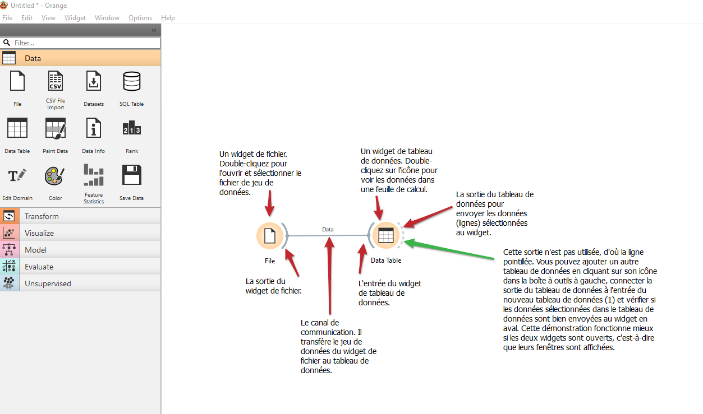
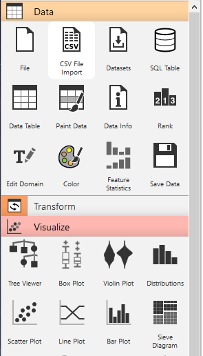
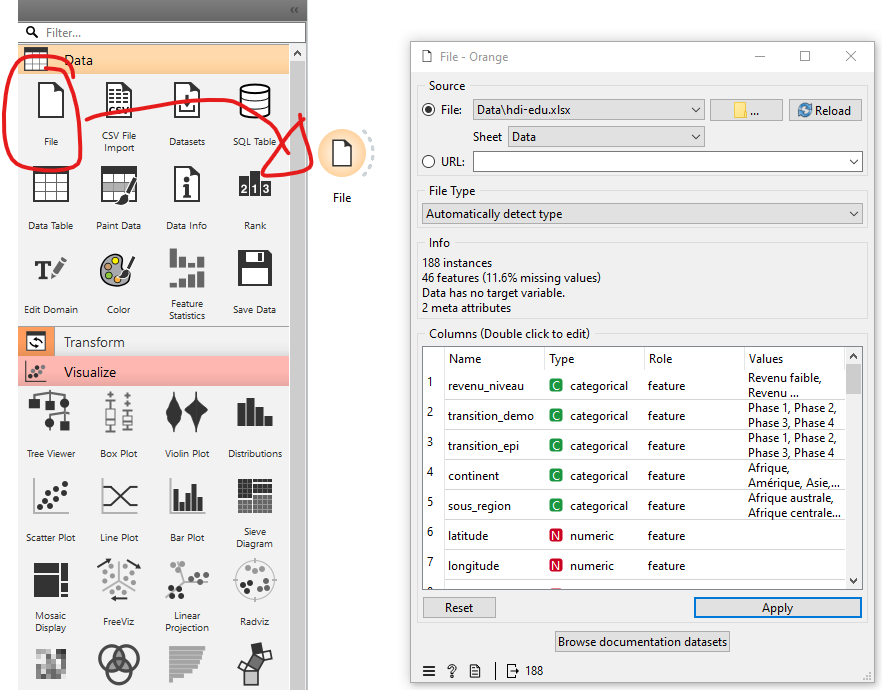
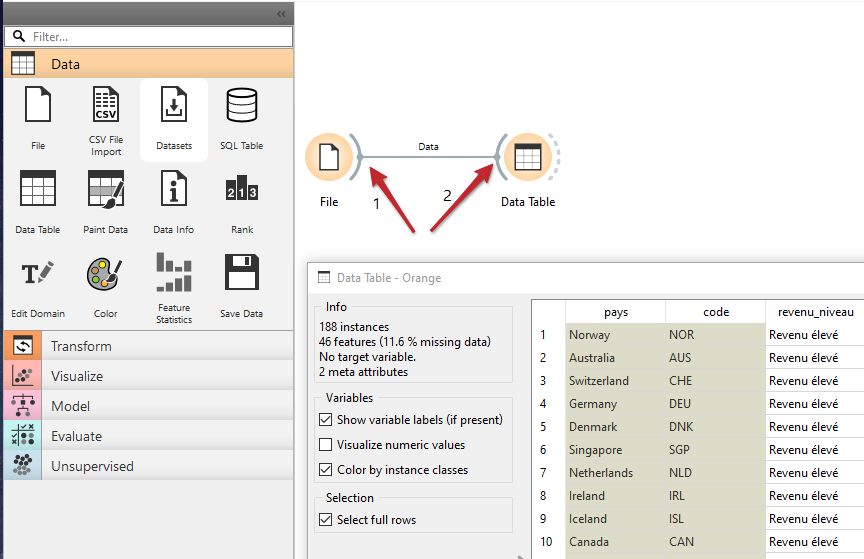
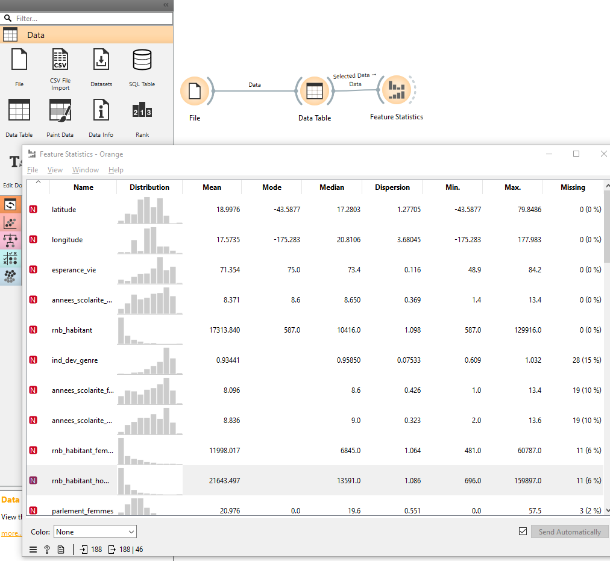
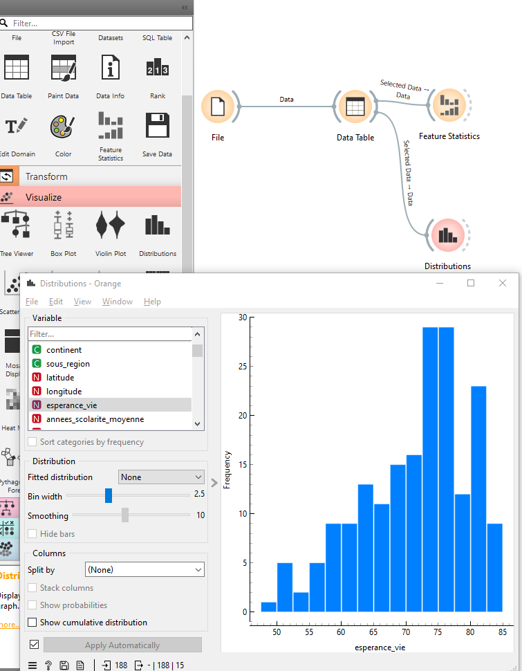
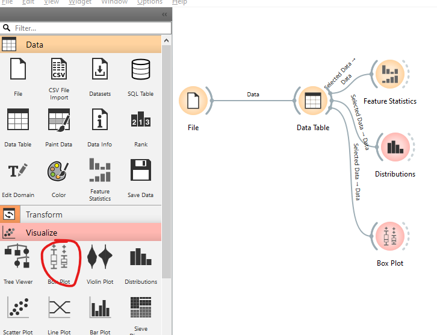

```{r setup, global_options,include=FALSE}
knitr::opts_chunk$set(
  dpi = 200,
  strip.white = T,
  message = FALSE,
  comment = NA,
  echo = FALSE,
  warning = FALSE,
  eval = TRUE
  
)
```

```{r include=FALSE}
source('./assets/functions.R')

requiredPackages = c('knitr','png','grid','gridExtra',
                     'RColorBrewer','dotenv')

PackageFacile(requiredPackages)

load_dot_env(".env")
annee = Sys.getenv("annee")

```


class: center, middle, inverse, title-slide, animated, fadeIn
# Analyse des données Licence Pro `r annee`
# TD n°2- L'analyse univariée<br /> <br />
### Florian Bayer

<div class="my-footer"><span>Géodata Paris - Licence Pro `r annee` : analyse de données - Florian Bayer</span></div> 

---
class: animated, fadeIn
## Objectif du TD 2
<div class="my-footer"><span>Géodata Paris - Licence Pro `r annee` : analyse de données - Florian Bayer</span></div> 

Les objectifs de ce TD sont de mettre en application les acquis du cours 2 sur l'analyse d'une série de données
- avec des graphiques
- les valeures centrales
- les paramètres de dispersion

Vous apprendrez à utiliser un outil d'analyse de données : Orange

---
class: animated, fadeIn
## Orange : présentation

<div class="my-footer"><span>Géodata Paris - Licence Pro `r annee` : analyse de données - Florian Bayer</span></div> 

Orange est un logiciel open source dédié à l'analyse de données, à l'exploration visuelle et à l'apprentissage automatique.

Basé sur des packages Python pour les analyses, son interface graphique intuitive permet de construire des **flux de travail** ou workflow, sans avoir à écrire de code.

Contrairement à Excel et comme lorsque l'on utilise du code, l'avantage d'Orange est de pouvoir relancer chaque étape du calcul pour le vérifier ou le modifier.


---
class: animated, fadeIn
## Orange : présentation

La vue principale d'Orange ressemble à une toile vide où vous pouvez commencer à ajouter des **widgets** pour créer un **workflow**. 

A gauche la zone de widgets, à droite l'espace de travail.

.center-img[
```{r echo=FALSE, out.width="100%"}

```
] 


<div class="my-footer"><span>Géodata Paris - Licence Pro `r annee` : analyse de données - Florian Bayer</span></div> 

---
class: animated, fadeIn
## Orange : les widgets

.pull-left[
Les widgets sont des modules préconfigurés qui permettent d'importer, de traiter, d'analyser et de visualiser des données. À gauche de l'écran se trouve une barre d'outils avec les catégories de widgets comme :
- Data : Chargement, transformation, filtrage des données
- Visualize : Graphiques et visualisations
- Model : Apprentissage automatique (classification, régression)
- Evaluate : Validation de modèles
]

.pull-right[
```{r echo=FALSE, out.width="70%"}

```
]

<div class="my-footer"><span>Géodata Paris - Licence Pro `r annee` : analyse de données - Florian Bayer</span></div> 

---
class: animated, fadeIn
## Orange : chargement des données

.pull-left[
Le chargement des données se fait à travers le widget "File" dans la catégorie "Data". Il vous permet d'importer des fichiers sous différents formats, y compris CSV ou Excel

- Ajoutez le widget "File" : Glissez-déposez le widget *File* depuis la barre d'outils dans l'espace de travail.
- Sélectionnez le fichier : Cliquez sur le widget "File" puis ouvrez **hdi-edu.xlsx**. Vérifiez que vous avez bien la feuille de calcul Data
- Orange détermine seul chaque type de données, mais vous pouvez les modifier manuellement via la colonne **Type**
- Fermez le widget *File*
]

.pull-right[
```{r echo=FALSE, out.width="100%"}

```
]

<div class="my-footer"><span>Géodata Paris - Licence Pro `r annee` : analyse de données - Florian Bayer</span></div> 

---
class: animated, fadeIn
## Orange : afficher les données

.pull-left[
- Dans la catégorie Data, sélectionnez et faites glisser le widget Data Table
- A l'aide de la souris, connectez la sortie du widget *File* à l'entrée du widget *Data Table*
- Vous pouvez voir maintenant le contenu des données via le widget *Data Table*
- Comme ils sont liés, tous changements dans le widget *File* entraînera une modification dans le widget *Data Table*
- Vous pouvez sélectionner des lignes dans *Data Table*, mais cela aura aussi un impact sur les futurs calculs. Ils ne se feront que sur les lignes sélectionnées
]

.pull-right[
```{r echo=FALSE, out.width="100%"}

```
]

<div class="my-footer"><span>Géodata Paris - Licence Pro `r annee` : analyse de données - Florian Bayer</span></div> 

---
class: animated, fadeIn
## Orange : Statistiques univariée

.pull-left[
- Ajoutez le widget *Feature Statistics*, toujours dans la catégorie Data.
- Connectez le à la sortie de *Data Table*
- Un histogramme, des valeurs centrales et des paramètres de dispersion sont disponibles
- Notez que Dispersion correspond au coefficient de variation pour les données quantitatives
- Attention, pensez à vérifier que vous n'avez pas de ligne sélectionnée dans Data Table, sinon les calculs de *Feature Statistics* seront uniquement fait sur votre sélection
- Notez que vous pouvez appliquer une couleur aux histogrammes pour les distinguer à l'aide d'une variable qualitative. Par exemple par continent.
]

.pull-right[
```{r echo=FALSE, out.width="100%"}

```
Faites l'analyse univariée de la variable **esperance_vie**. Que pouvez-vous en conclure ?
]


<div class="my-footer"><span>Géodata Paris - Licence Pro `r annee` : analyse de données - Florian Bayer</span></div>

---
class: animated, fadeIn
## Orange : Histogramme

.pull-left[
- A partir de la catégorie Visualize, ajoutez le widget *Distributions*.
- Connectez le à la sortie de *Data Table*
- Les données qualitatives (Category) sont représentées par un diagramme en bâton
- Les données quantitatives par un histogramme
- Pour ce dernier, vous pouvez modifier le nombre de *bins*

Comme précédemment, vous pouvez appliquer une catégorie pour découper l'histogramme selon les modalités de cette dernière. Pour la variable **esperance_vie**, faites un split par **transition_epi**. Que pouvez-vous en conclure ? N'oubliez pas de consulter les métadonnées (onglet Meta du fichier Excel) pour plus de détails
]

.pull-right[
```{r echo=FALSE, out.width="100%"}

```
]

<div class="my-footer"><span>Géodata Paris - Licence Pro `r annee` : analyse de données - Florian Bayer</span></div>

---
class: animated, fadeIn
## Orange : Box Plot

.pull-left[
- Ajoutez maintenant un Box Plot.
- Connectez le à la sortie de *Data Table*

Analysez la distribution de **taux_fertilite**, puis faites un sous-groupe avec transition_demo. 

Que pouvez-vous en conclure ? 

**Pensez à sauvegarder votre projet Orange, nous le réutiliserons pour le TD 5**
]

.pull-right[
```{r echo=FALSE, out.width="100%"}

```
]

<div class="my-footer"><span>Géodata Paris - Licence Pro `r annee` : analyse de données - Florian Bayer</span></div>

---
class: animated, fadeIn
## Orange : Analyse comparative

<div class="my-footer"><span>Géodata Paris - Licence Pro `r annee` : analyse de données - Florian Bayer</span></div>

**Consignes :**

1. **Formez des binômes**
2. **Analysez la variable `esperance_vie`** avec Feature Statistics et Box Plot

**Étape 1 - Vue d'ensemble**  :
- Analysez les **moyennes** et **écart-types** pour chaque continent (split)
- Utilisez le **Box Plot** avec split par **Continent** pour comparer l'Afrique aux autres continents
- Que révèle ces analyses ?

**Étape 2 - Analyse par pays africains**  :
- Maintenant et l'aide d'un nouveau flux, faites l'analyse pour les pays africains
- Identifiez les pays avec les `esperance_vie` extrêmes (outliers + min/max)
- Choisissez 2 pays opposés pour votre analyse. 

---
class: animated, fadeIn
## Situer les pays extrêmes

<div class="my-footer"><span>Géodata Paris - Licence Pro `r annee` : analyse de données - Florian Bayer</span></div>

À partir de votre analyse des pays africains, vous allez **décrire** vos deux pays opposés en les situant dans la distribution des autres variables.

**Étape 3 - Identifier les cas extrêmes** :
- **Pays avec la plus haute espérance de vie** : …………………………
- **Pays avec la plus basse espérance de vie** : …………………………
- **Outliers détectés** (si il y en a) : …………………………

**Étape 4 - Dresser le profil des deux pays** :

Choisissez 4 ou 5 autres variables (économiques, sociales, sanitaires ; l'onglet **Meta** décrit les indicateurs). Pour chacune, situez vos deux pays parmi les pays africains à l'aide de **Feature Statistics** et du **Box Plot** : au-dessus ou au-dessous de la médiane ? Dans quel quartile ? Est-ce un outlier ?

---
class: animated, fadeIn
## Profil des pays : tableau à compléter

<div class="my-footer"><span>Géodata Paris - Licence Pro `r annee` : analyse de données - Florian Bayer</span></div>

.font90[
| Variable | Médiane (Afrique) | Pays 1 | Position | Pays 2 | Position |
|---|---|---|---|---|---|
| esperance_vie | | | | | |
| ............... | | | | | |
| ............... | | | | | |
| ............... | | | | | |
| ............... | | | | | |
]

*Position* : 1er, 2e, 3e ou 4e quartile, ou outlier.

**Étape 5 - Des questions pour la suite** :
- Pour quelles variables vos deux pays s'opposent-ils le plus ?
- Pour lesquelles sont-ils proches, malgré des espérances de vie très différentes ?

Notez ces pistes : vous ne pouvez pas encore conclure, deux pays ne suffisent pas à établir un lien entre deux variables. Nous les testerons sur l'ensemble des pays au cours 5.

---
class: animated, fadeIn
## Restitution collective

<div class="my-footer"><span>Géodata Paris - Licence Pro `r annee` : analyse de données - Florian Bayer</span></div>

.font90[
**Tour de table** : Chaque binôme présente en 1 minute :
- Leurs deux pays extrêmes et leur profil
- La variable pour laquelle ils s'opposent le plus
- Une découverte surprenante dans les données

**Questions de débriefing** :
- Quelles variables distinguent le plus souvent les pays extrêmes ?
- Certains pays sont-ils atypiques (outliers) pour plusieurs variables à la fois ?
- Peut-on affirmer qu'une variable « explique » l'espérance de vie à partir de deux pays ?

**Synthèse pédagogique** :
- **Dispersion** : L'écart-type révèle des sous-groupes de pays avec des profils similaires
- **Position** : Une valeur ne prend son sens que située dans une distribution (médiane, quartiles, outliers)
- **Contextualisation** : Les chiffres racontent des histoires humaines et géographiques
- **Démarche scientifique** : Observer, décrire, puis formuler des questions à tester
- **Prudence** : Deux pays ne font pas une règle. Pour savoir si deux variables varient ensemble, il faudra mesurer leur relation sur l'ensemble des pays
]

---
class: animated, fadeIn
## Dans ce TD, vous avez appris à

.pull-left[
**Compétences techniques :**
- Charger et manipuler des données dans Orange
- Calculer et interpréter les mesures de tendance centrale (moyenne, médiane)
- Calculer et interpréter les mesures de dispersion (écart-type, coefficient de variation)
- Créer et analyser différents types de graphiques (histogrammes, box plots)
- Comparer des distributions entre groupes (continents)
]

.pull-right[
**Compétences analytiques :**
- Décrire le profil d'un individu à partir de plusieurs variables
- Identifier les valeurs extrêmes et aberrantes (outliers)
- Comprendre qu'une moyenne cache des disparités (importance de l'écart-type)
- Contextualiser les résultats statistiques avec des connaissances géographiques
- Situer un individu dans une distribution (médiane, quartiles, outliers)
]

Vous avez repéré des variables pour lesquelles les pays extrêmes s'opposent. Pour savoir si ces variables évoluent réellement ensemble sur l'ensemble des pays, il faudra mesurer leur relation : ce sera l'objet du cours 5 sur la corrélation. D'ici là, les cours 3 et 4 porteront sur la cartographie de ces données.

<div class="my-footer"><span>Géodata Paris - Licence Pro `r annee` : analyse de données - Florian Bayer</span></div>


