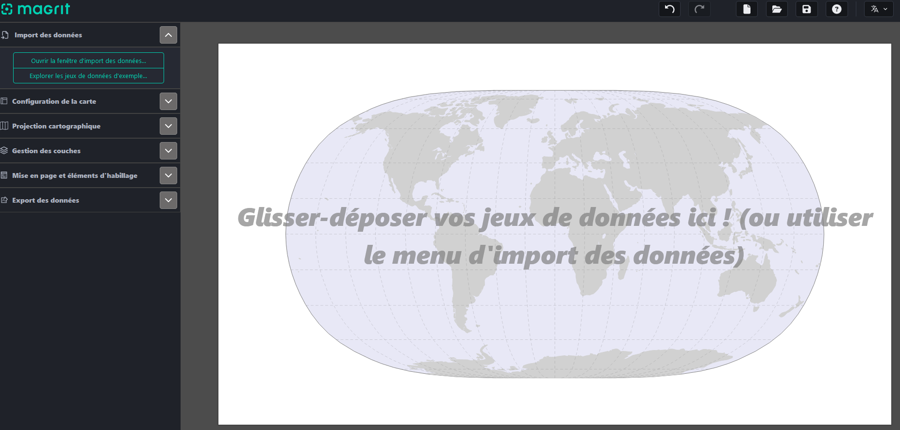
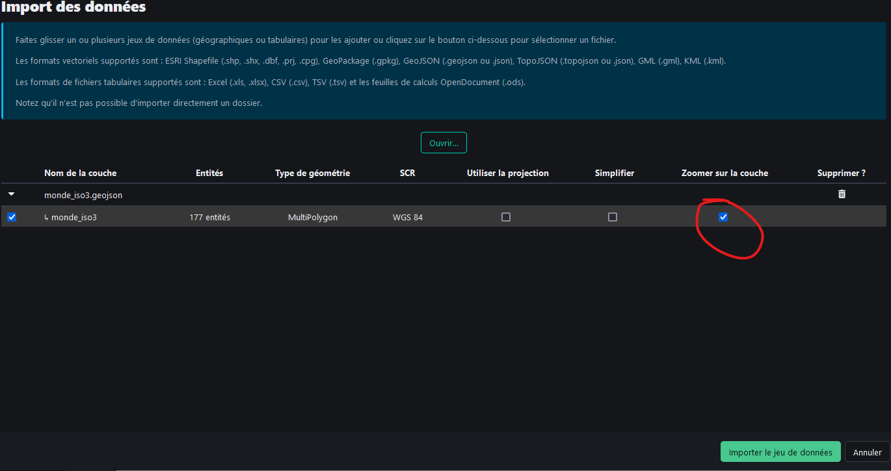
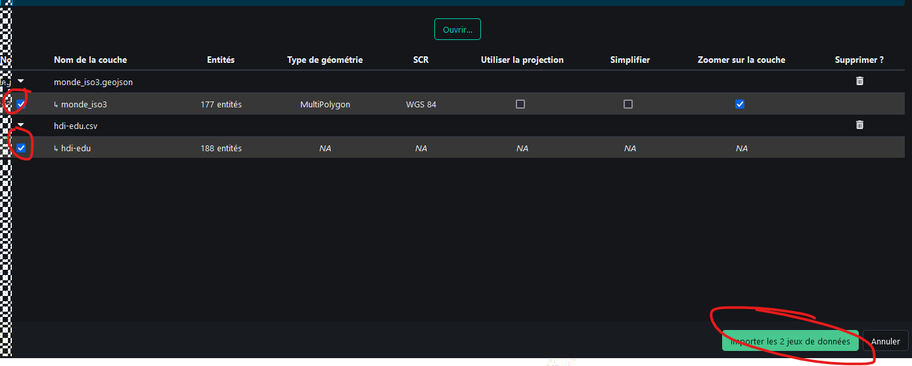
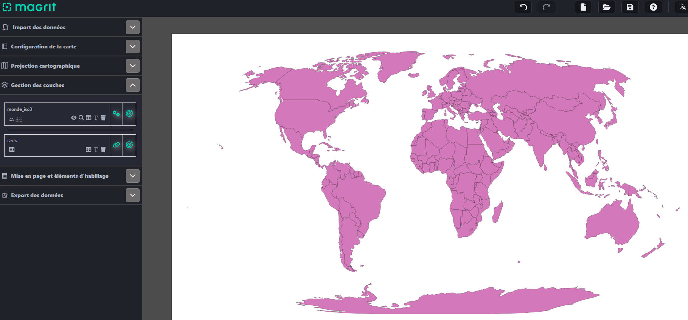
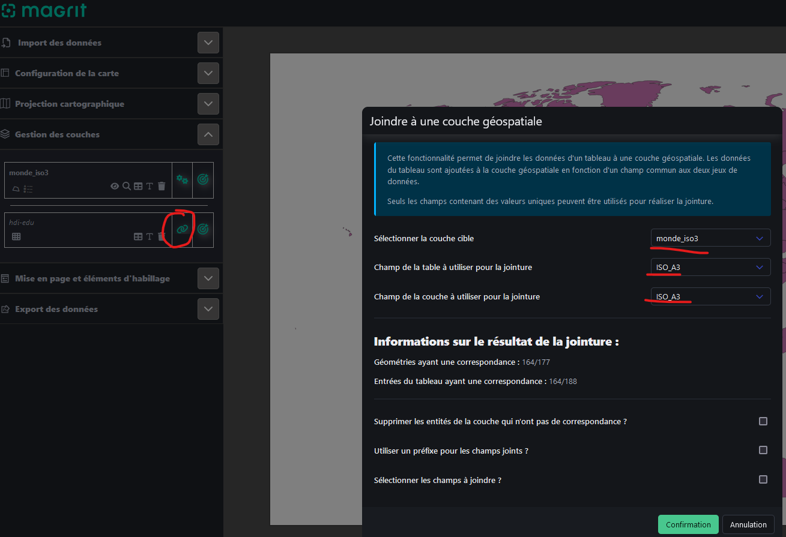
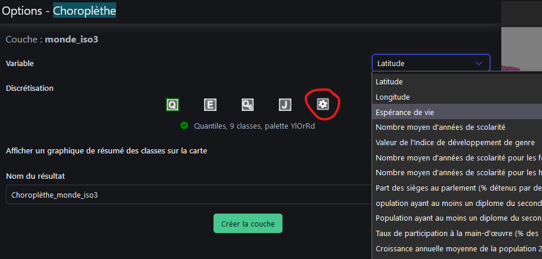
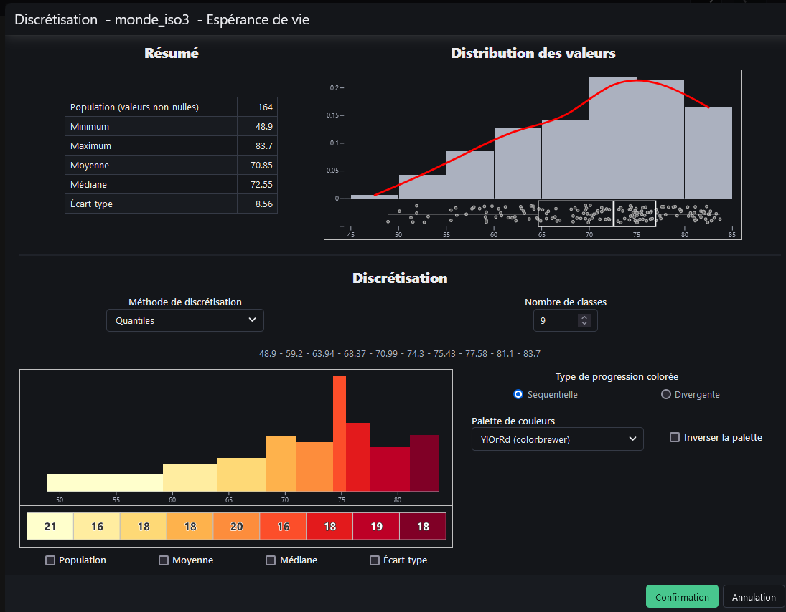

```{r setup, global_options,include=FALSE}
knitr::opts_chunk$set(
  dpi = 200,
  strip.white = T,
  message = FALSE,
  comment = NA,
  echo = FALSE,
  warning = FALSE,
  eval = TRUE
  
)
```

```{r include=FALSE}
source('./assets/functions.R')

requiredPackages = c('knitr','png','grid','gridExtra',
                     'RColorBrewer','dotenv')

PackageFacile(requiredPackages)

load_dot_env(".env")
annee = Sys.getenv("annee")

```


class: center, middle, inverse, title-slide, animated, fadeIn
# Analyse des données Licence Pro `r annee`
# TD n°3- La discrétisation en cartographie<br /> <br />
### Florian Bayer

<div class="my-footer"><span>ENSG - Licence Pro `r annee` : analyse de données - Florian Bayer</span></div>

---
class: animated, fadeIn
## Objectif du TD 3
<div class="my-footer"><span>ENSG - Licence Pro `r annee` : analyse de données - Florian Bayer</span></div>

Les objectifs de ce TD sont de mettre en application les acquis du cours 3 sur la discrétisation en cartographie

Vous apprendrez à utiliser un outil d'analyse de cartographie : Magrit

---
class: animated, fadeIn
## Magrit : présentation

<div class="my-footer"><span>ENSG - Licence Pro `r annee` : analyse de données - Florian Bayer</span></div>

Magrit est un logiciel de cartographie en ligne.

Il permet de créer facilement des cartes, de les discrétiser et même de les mettre en page.

Il est accessible directement via https://magrit.cnrs.fr/app/

Vous pouvez aussi le déployer sur votre serveur avec Docker

---
class: animated, fadeIn
## Magrit : présentation

La vue principale de Magrit est composée d'une zone d'affichage pour la carte et d'une barre d'outils

.center-img[
```{r echo=FALSE, out.width="100%"}

```
]


<div class="my-footer"><span>ENSG - Licence Pro `r annee` : analyse de données - Florian Bayer</span></div>

---
class: animated, fadeIn
## Magrit : charger le fond de carte

Il faut charger dans un premier temps le fond de carte :
- Cliquez sur *Ouvrir la fenêtre d'import des données*
- Chargez le fichier **monde_iso3.geojson**
- Cliquez sur *Zoomer sur la couche*
- Ne **cliquez pas** encore sur *Importer le jeu de données*

.center-img[
```{r echo=FALSE, out.width="80%"}

```
]

<div class="my-footer"><span>ENSG - Licence Pro `r annee` : analyse de données - Florian Bayer</span></div>


---
class: animated, fadeIn
## Magrit : charger les données

Le fond de carte ne contient pas les données que vous allez cartographier. Pour cela, il faut charger le fichier Excel du TD2 sur le niveau de vie des pays du Monde
- Cliquez sur *Ouvrir*
- Chargez le fichier **hdi-edu.csv**. Évitez de prendre le fichier XLSX, Magrit reconnaît mal les fichiers Excel.
- **Cliquez**  sur *Importer les 2 jeux de données*

.center-img[
```{r echo=FALSE, out.width="80%"}

```
]

<div class="my-footer"><span>ENSG - Licence Pro `r annee` : analyse de données - Florian Bayer</span></div>

---
class: animated, fadeIn
## Magrit : fond et données

Vous devriez voir votre fond de carte et **monde_iso3** et **hdi-edu** dans *Gestion des couches*


.center-img[
```{r echo=FALSE, out.width="100%"}

```
]

Cependant, Magrit ne fait pas encore le lien entre les deux. Pour cela, il faut faire une **jointure** entre le fond de carte et les données.

<div class="my-footer"><span>ENSG - Licence Pro `r annee` : analyse de données - Florian Bayer</span></div>

---
class: animated, fadeIn
## Magrit : jointure
.font80[
En base de données, une jointure permet de lier le contenu d'au moins deux tables. Ici un fond de carte (une table avec des informations vectorielles) et un tableau.

Cliquez sur le symbole de jointure à côté de **hdi-edu** dans *Gestion des couches*. Pour faire la jointure, il faut des champs avec des données communes aux deux tables. Dans notre cas, le champ ISO_A3 présent sur le fond de carte et les données. Confirmez la jointure
]

.center-img[
```{r echo=FALSE, out.width="70%"}

```
]

<div class="my-footer"><span>ENSG - Licence Pro `r annee` : analyse de données - Florian Bayer</span></div>

---
class: animated, fadeIn
## Magrit : carte choroplèthe

Vous allez maintenant créer une carte choroplèthe.
- Cliquez sur la cible à côté de la couche monde_iso3.
- Dans la nouvelle fenêtre, choisissez *Choroplèthe*.
- Dans variable, choisissez **taux_fertilite**
- Enfin, dans Discrétisation, cliquez sur la discrétisation manuelle <i class="fa-solid fa-gear"></i>


.center-img[
```{r echo=FALSE, out.width="70%"}

```
]


<div class="my-footer"><span>ENSG - Licence Pro `r annee` : analyse de données - Florian Bayer</span></div>

---
class: animated, fadeIn
## Magrit : discrétisation

.pull-left[Dans la nouvelle fenêtre, des informations sur la distribution s'affichent.

L'objectif de notre carte sera de découvrir la répartition spatiale de l'espérance de vie dans les pays du Monde.

Choisissez la méthode qui vous paraît la plus pertinente en fonction du contexte et de la distribution statistique.

**Justifiez votre choix par écrit**

**Confirmer** puis **Créer la couche**
]

.pull-right[.center-img[
```{r echo=FALSE, out.width="100%"}

```
]]

Utilisez les éléments de l'onglet *Mise en page et éléments d'habillage* pour faire la mise en page de votre carte. Elle sera corrigé avec l'enseignant.


<div class="my-footer"><span>ENSG - Licence Pro `r annee` : analyse de données - Florian Bayer</span></div>

---
class: animated, fadeIn
## Fin du TD3

Magrit est un outil de cartographie très puissant et relativement simple à utiliser. Il est à privilégier pour produire vos cartes. Cependant, pour un meilleur rendu, il faut souvent exporter la carte et l'améliorer dans Inkscape ou Illustrator.

Dans ce TD, vous avez appris :
- A charger des données dans Magrit
- A faire une jointure
- A créer une carte choroplèthe dans Magrit
- A la discrétiser
- A la mettre en page 

Dans le prochain cours, nous verrons ensemble comment mesurer les liens entre deux données quantitatives.

<div class="my-footer"><span>ENSG - Licence Pro `r annee` : analyse de données - Florian Bayer</span></div>


