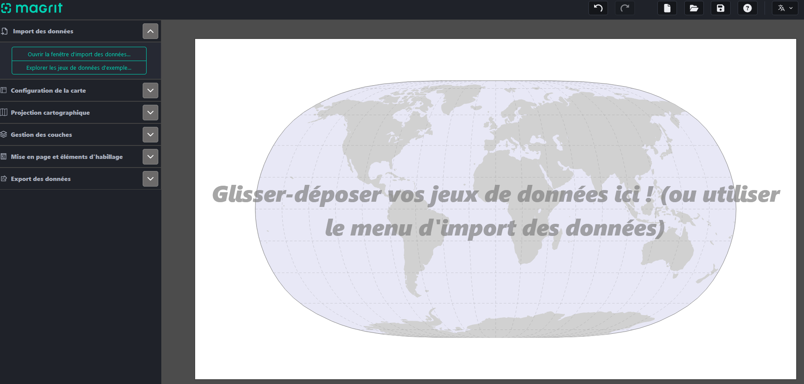
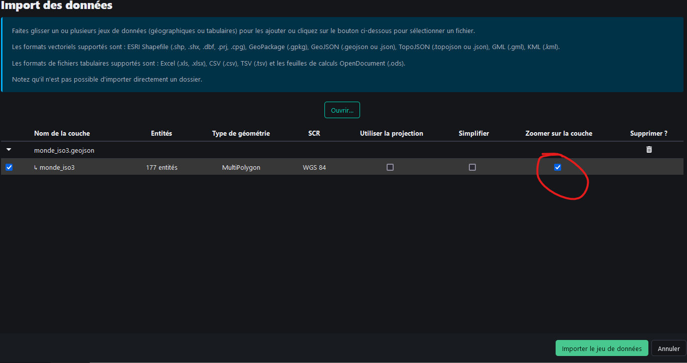
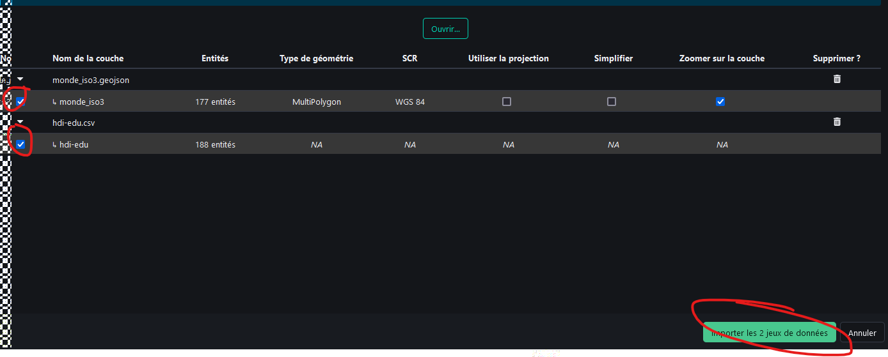
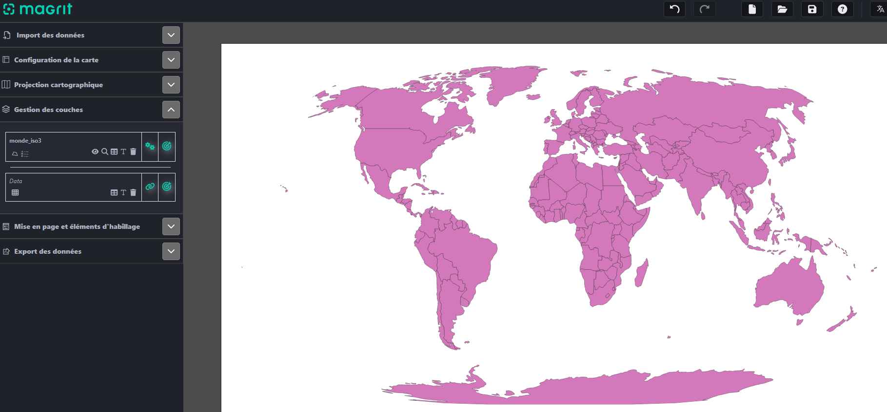
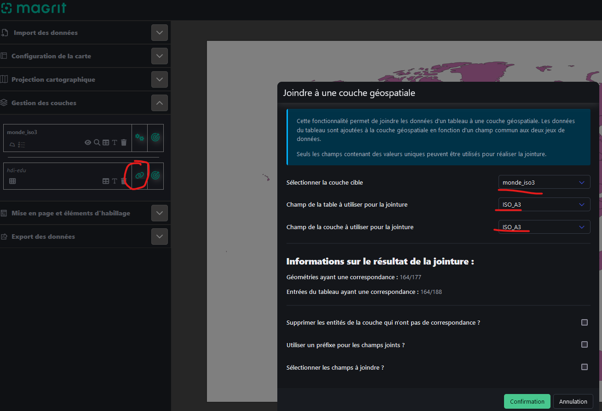

```{r setup, global_options,include=FALSE}
knitr::opts_chunk$set(
  dpi = 200,
  strip.white = T,
  message = FALSE,
  comment = NA,
  echo = FALSE,
  warning = FALSE,
  eval = TRUE
  
)
```

```{r include=FALSE}
source('./assets/functions.R')

requiredPackages = c('knitr','png','grid','gridExtra',
                     'RColorBrewer','dotenv')

PackageFacile(requiredPackages)

load_dot_env(".env")
annee = Sys.getenv("annee")

```


class: center, middle, inverse, title-slide, animated, fadeIn
# Analyse des données Licence Pro `r annee`
# TD n°3- La sémiologie graphique avec Magrit<br /> <br />
### Florian Bayer

<div class="my-footer"><span>Géodata Paris - Licence Pro `r annee` : analyse de données - Florian Bayer</span></div>

---
class: animated, fadeIn
## Organisation du TD 3
<div class="my-footer"><span>Géodata Paris - Licence Pro `r annee` : analyse de données - Florian Bayer</span></div>

**Première partie (guidée)** : découverte de Magrit et réalisation de trois cartes, une par grand type de données : **stock**, **taux** et **qualitatif**.

**Deuxième partie (en autonomie, individuellement)** : répondre à une commande en produisant deux cartes, puis les vérifier à l'aide d'une grille.

**Objectifs pédagogiques** :
- Prendre en main un outil de cartographie numérique (Magrit)
- Choisir l'implantation, la figuration et la variable visuelle adaptées au type de données
- Mettre en page une carte complète et lisible
- Porter un regard critique sur ses propres cartes

---
class: animated, fadeIn
## Objectif du TD 3
<div class="my-footer"><span>Géodata Paris - Licence Pro `r annee` : analyse de données - Florian Bayer</span></div>

Les objectifs de ce TD sont de mettre en application les acquis du cours 3 sur la **sémiologie graphique**.

Pour chaque carte, posez-vous toujours les mêmes questions :
1. Quel est le **type de données** ? (qualitative nominale, ordinale, quantitative de stock, de taux)
2. Quelle **notion** faut-il transmettre ? (différence, ordre, proportionnalité)
3. Quelle **variable visuelle** permet de la transmettre ?

La discrétisation sera étudiée en détail au cours 4 : pour les cartes choroplèthes de ce TD, **conservez la méthode proposée par défaut** par Magrit.

---
class: inverse, center, middle, animated, fadeIn
# 1- Prise en main guidée de Magrit

<div class="my-footer-title "></div>

---
class: animated, fadeIn
## Magrit : présentation

<div class="my-footer"><span>Géodata Paris - Licence Pro `r annee` : analyse de données - Florian Bayer</span></div>

Magrit est un logiciel de cartographie en ligne.

Il permet de créer facilement des cartes, de les discrétiser et même de les mettre en page.

Il est accessible directement via https://magrit.cnrs.fr/app/

Vous pouvez aussi le déployer sur votre serveur avec Docker

---
class: animated, fadeIn
## Magrit : présentation

La vue principale de Magrit est composée d'une zone d'affichage pour la carte et d'une barre d'outils

.center-img[
```{r echo=FALSE, out.width="100%"}

```
]


<div class="my-footer"><span>Géodata Paris - Licence Pro `r annee` : analyse de données - Florian Bayer</span></div>

---
class: animated, fadeIn
## Magrit : charger le fond de carte

Il faut charger dans un premier temps le fond de carte :
- Cliquez sur *Ouvrir la fenêtre d'import des données*
- Chargez le fichier **monde_iso3.geojson**
- Cliquez sur *Zoomer sur la couche*
- Ne **cliquez pas** encore sur *Importer le jeu de données*

.center-img[
```{r echo=FALSE, out.width="80%"}

```
]

<div class="my-footer"><span>Géodata Paris - Licence Pro `r annee` : analyse de données - Florian Bayer</span></div>


---
class: animated, fadeIn
## Magrit : charger les données

Le fond de carte ne contient pas les données que vous allez cartographier. Pour cela, il faut charger le fichier du TD2 sur le niveau de vie des pays du Monde (une colonne **population** a été ajoutée)
- Cliquez sur *Ouvrir*
- Chargez le fichier **hdi-edu.csv**. Évitez de prendre le fichier XLSX, Magrit reconnaît mal les fichiers Excel.
- **Cliquez**  sur *Importer les 2 jeux de données*

.center-img[
```{r echo=FALSE, out.width="80%"}

```
]

<div class="my-footer"><span>Géodata Paris - Licence Pro `r annee` : analyse de données - Florian Bayer</span></div>

---
class: animated, fadeIn
## Magrit : fond et données

Vous devriez voir votre fond de carte et **monde_iso3** et **hdi-edu** dans *Gestion des couches*


.center-img[
```{r echo=FALSE, out.width="100%"}

```
]

Cependant, Magrit ne fait pas encore le lien entre les deux. Pour cela, il faut faire une **jointure** entre le fond de carte et les données.

<div class="my-footer"><span>Géodata Paris - Licence Pro `r annee` : analyse de données - Florian Bayer</span></div>

---
class: animated, fadeIn
## Magrit : jointure
.font80[
En base de données, une jointure permet de lier le contenu d'au moins deux tables. Ici un fond de carte (une table avec des informations vectorielles) et un tableau.

Cliquez sur le symbole de jointure à côté de **hdi-edu** dans *Gestion des couches*. Pour faire la jointure, il faut des champs avec des données communes aux deux tables. Dans notre cas, le champ ISO_A3 présent sur le fond de carte et les données. Confirmez la jointure
]

.center-img[
```{r echo=FALSE, out.width="70%"}

```
]

<div class="my-footer"><span>Géodata Paris - Licence Pro `r annee` : analyse de données - Florian Bayer</span></div>

---
class: animated, fadeIn
## Carte 1 : une donnée de stock
<div class="my-footer"><span>Géodata Paris - Licence Pro `r annee` : analyse de données - Florian Bayer</span></div>

**Question** : où vit la population mondiale ?

La variable **population** est une donnée **quantitative de stock** : la somme a un sens. La notion à transmettre est la **proportionnalité**, donc la variable visuelle **taille**.

- Cliquez sur la cible à côté de la couche **monde_iso3**
- Choisissez la représentation *Symboles proportionnels*
- Variable : **population**
- Figuré : un **cercle**, sans effet de volume
- Ajustez la taille du plus grand cercle pour qu'il reste lisible sans masquer les pays voisins
- Créez la couche

.content-box-blue[
**À noter** : pourquoi ne faut-il pas représenter la population par une carte choroplèthe ? Qu'est-ce que le lecteur comprendrait ?
]

---
class: animated, fadeIn
## Carte 2 : une donnée de taux
<div class="my-footer"><span>Géodata Paris - Licence Pro `r annee` : analyse de données - Florian Bayer</span></div>

**Question** : comment l'espérance de vie varie-t-elle dans le monde ?

La variable **esperance_vie** est une donnée **quantitative de taux** : la somme n'a pas de sens. La notion à transmettre est l'**ordre**, donc la variable visuelle **valeur** (carte choroplèthe).

- Cliquez sur la cible à côté de **monde_iso3**, choisissez *Choroplèthe*
- Variable : **esperance_vie**, discrétisation proposée par défaut
- Choisissez une **palette** qui respecte les règles du cours :
  - un **camaïeu** (une seule teinte, du clair au foncé) ou une **gradation harmonique** (du jaune au rouge)
  - pas de blanc pour la première classe : il est réservé à l'absence de données
- Créez la couche, puis affichez-la **sous** la couche des cercles proportionnels

.content-box-blue[
**À noter** : quel sens de lecture avez-vous choisi (foncé = espérance de vie forte ou faible) ? Pourquoi ?
]

---
class: animated, fadeIn
## Carte 3 : une donnée qualitative
<div class="my-footer"><span>Géodata Paris - Licence Pro `r annee` : analyse de données - Florian Bayer</span></div>

**Question** : comment se répartissent les pays selon leur continent, puis selon leur niveau de revenu ?

- **continent** est une donnée **qualitative nominale** : la notion à transmettre est la **différence**, donc la variable visuelle **couleur** (des teintes différentes, de même intensité).
- **revenu_niveau** est une donnée **qualitative ordinale** (faible, intermédiaire, élevé) : la notion à transmettre est l'**ordre**, donc la **valeur**.

Réalisez les deux cartes avec la représentation *Typologie* (carte qualitative) :
- Pour **continent**, choisissez des couleurs bien distinctes et harmonieuses
- Pour **revenu_niveau**, modifiez les couleurs à la main pour obtenir une progression du clair au foncé, **dans le bon ordre**

.content-box-blue[
**À noter** : que se passe-t-il si l'on garde les couleurs proposées par défaut pour **revenu_niveau** ?
]

---
class: animated, fadeIn
## Habillage et mise en page
<div class="my-footer"><span>Géodata Paris - Licence Pro `r annee` : analyse de données - Florian Bayer</span></div>

Une carte n'est pas terminée sans ses éléments d'habillage. Dans l'onglet *Mise en page et éléments d'habillage*, ajoutez :

- Un **titre** qui dit ce que montre la carte (le quoi, le où, le quand)
- Une **légende** complète : titre de la légende et **unités**
- La **source** des données : *PNUD, Rapport sur le développement humain ; population : Natural Earth*
- L'**auteur** et la **date** de réalisation

À l'échelle du monde, l'échelle graphique varie selon la latitude : ne l'ajoutez pas. La flèche du nord est inutile sur un planisphère.

**Exportez** vos cartes en SVG ou en PNG. Nous en corrigerons certaines ensemble.

---
class: inverse, center, middle, animated, fadeIn
# 2- À vous de cartographier

<div class="my-footer-title "></div>

---
class: animated, fadeIn
## La commande
<div class="my-footer"><span>Géodata Paris - Licence Pro `r annee` : analyse de données - Florian Bayer</span></div>

**Individuellement**, choisissez **un sujet** et produisez **deux cartes** mises en page qui y répondent.

.font90[
| Sujet | Question | Variables suggérées |
|---|---|---|
| **A. Femmes et pouvoir** | Où les femmes sont-elles les mieux représentées en politique ? | parlement_femmes, population |
| **B. Transition démographique** | Où en sont les pays dans leur transition démographique ? | transition_demo, taux_fertilite |
| **C. Emploi** | Où l'agriculture reste-t-elle le premier employeur ? | emploi_agriculture, continent |
| **D. Éducation** | L'accès à l'école est-il le même pour les filles et les garçons ? | annees_scolarite_femmes, annees_scolarite_hommes |
]

Vous pouvez superposer deux représentations sur une même carte (par exemple des cercles proportionnels sur une carte choroplèthe) si cela sert votre message.

---
class: animated, fadeIn
## Justifier vos choix
<div class="my-footer"><span>Géodata Paris - Licence Pro `r annee` : analyse de données - Florian Bayer</span></div>

Pour **chaque carte**, rédigez une courte fiche (5 à 10 lignes) :

1. **Les données** : quelles variables ? Quel type pour chacune ?
2. **La notion** à transmettre : différence, ordre ou proportionnalité ?
3. **L'implantation et la figuration** retenues
4. **La variable visuelle** utilisée, et pourquoi elle est adaptée
5. **Le message** : que doit retenir le lecteur au premier coup d'œil ?

.content-box-yellow[
Une carte juste mais sans message n'est pas une bonne carte : le titre et la légende doivent guider le lecteur.
]

---
class: animated, fadeIn
## Vérifier vos cartes
<div class="my-footer"><span>Géodata Paris - Licence Pro `r annee` : analyse de données - Florian Bayer</span></div>

Avant de rendre vos cartes, vérifiez-les à l'aide de la grille suivante :

.font90[
| Critère | Oui / Non |
|---|---|
| La variable visuelle est adaptée au type de données | |
| L'ordre des valeurs est respecté (du clair au foncé) | |
| Le blanc est réservé à l'absence de données | |
| Les cercles sont proportionnels (et sans effet de volume) | |
| Le titre dit ce que montre la carte | |
| La légende est complète (titre, unités) | |
| La source, l'auteur et la date sont indiqués | |
| Le message se comprend au premier coup d'œil | |
]

Corrigez vos cartes pour chaque critère non respecté.

---
class: animated, fadeIn
## Fin du TD 3
<div class="my-footer"><span>Géodata Paris - Licence Pro `r annee` : analyse de données - Florian Bayer</span></div>

Dans ce TD, vous avez appris :
- A charger des données dans Magrit et à faire une jointure
- A choisir une représentation adaptée au type de données : symboles proportionnels, choroplèthe, typologie
- A choisir des couleurs qui respectent les règles de la sémiologie graphique
- A mettre en page une carte complète
- A vérifier une carte de manière critique

**À rendre** : vos deux cartes exportées et leurs fiches de justification.

Dans le prochain cours, nous verrons comment **discrétiser** une série statistique pour les cartes choroplèthes.
