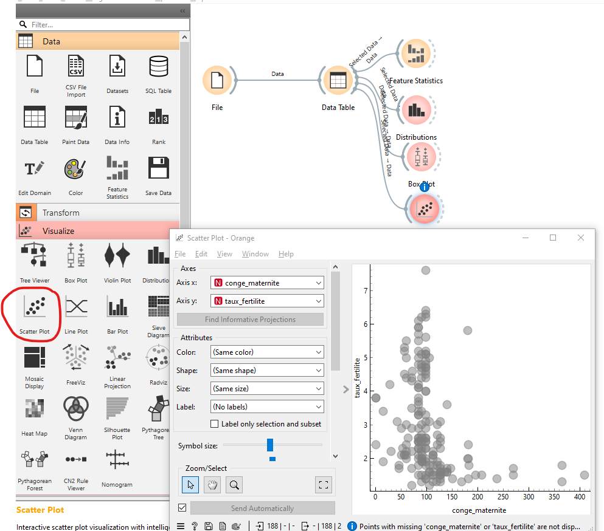
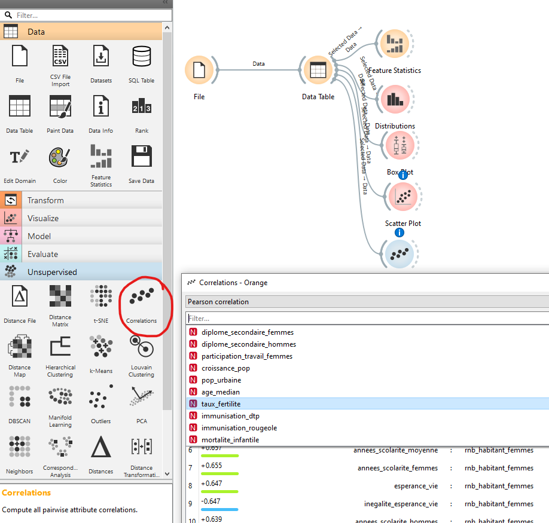

```{r setup, global_options,include=FALSE}
knitr::opts_chunk$set(
  dpi = 200,
  strip.white = T,
  message = FALSE,
  comment = NA,
  echo = FALSE,
  warning = FALSE,
  eval = TRUE
  
)
```

```{r include=FALSE}
source('./assets/functions.R')

requiredPackages = c('knitr','png','grid','gridExtra',
                     'RColorBrewer','dotenv')

PackageFacile(requiredPackages)

load_dot_env(".env")
annee = Sys.getenv("annee")

```


class: center, middle, inverse, title-slide, animated, fadeIn
# Analyse des données Licence Pro `r annee`
# TD n°4- La corrélation<br /> <br />
### Florian Bayer

<div class="my-footer"><span>ENSG - Licence Pro `r annee` : analyse de données - Florian Bayer</span></div>

---
class: animated, fadeIn
## Objectif du TD 4
<div class="my-footer"><span>ENSG - Licence Pro `r annee` : analyse de données - Florian Bayer</span></div>

Les objectifs de ce TD sont de mettre en application les acquis du cours 4 sur la corrélation
- graphiques
- coefficient de corrélation de Pearson
- coefficient de corrélation de Spearman

Vous ferez les analyses avec Orange

---
class: animated, fadeIn
## Contexte de l'étude

En tant que chargé d'étude, la Banque Mondiale vous demande de l'aider à préparer un colloque sur la natalité dans le monde.

Vous avez déjà produit une carte sur le taux de fertilité qui vous servira de base à la réflexion. Cependant, on vous demande de compléter l'étude en illustrant les facteurs qui pourraient expliquer les forts ou faibles taux de fertilité dans les pays du Monde.

<div class="my-footer"><span>ENSG - Licence Pro `r annee` : analyse de données - Florian Bayer</span></div>

---
class: animated, fadeIn
## Première étape : réflexions et hypothèses

Il est fortement déconseillé d'aborder le sujet de manière exploratoire. Vous risquez de trouver des relations que vous ne pourrez pas expliquer.

Une approche hypothético-déductive est préférable.
- En fonction de vos connaissances, quels seraient les facteurs pouvant expliquer en partie la variation de la natalité dans les pays du Monde ?
- Qu'elle serait le sens de la relation ?
- Ecrivez vos hypothèses (au moins 2) avec un petit argumentaire.

Ensuite, vérifiez dans le fichier excel **hdi-edi.xlsx** si des variables peuvent correspondre à vos hypothèses.

<div class="my-footer"><span>ENSG - Licence Pro `r annee` : analyse de données - Florian Bayer</span></div>

---
class: animated, fadeIn
## Seconde étape : test graphique de vos hypothèses

.pull-left[
Il est temps de tester vos hypothèses.
- Ouvrez Orange et chargez le workflow du TD2. Sinon, rechargez les données
- Connecter le widget **Scatter Plot** à la sortie de *Data table*
- En axe des Y, ajoutez *taux_fertilité*. En X, vos différentes variables servant à tester vos hypothèses. Vous pouvez sauvegarder vos Scatter Plots en bas à gauche de la fenêtre.
- Notez que vous pouvez aussi ajouter des couleurs pour ajouter une dimension spatiale à votre Scatter Plot
]

.pull-right[
```{r echo=FALSE, out.width="100%"}

```
]

<div class="my-footer"><span>ENSG - Licence Pro `r annee` : analyse de données - Florian Bayer</span></div>

---
class: animated, fadeIn
## Seconde étape : test statistique de vos hypothèses

.pull-left[
Vérifions maintenant l'intensité de vos corrélations

- Ajoutez le widget **Correlation** et connectez le à *Data File*
- Sélectionnez la variable taux_fertilite
- Observez les résultats. Quelle est l'intensité de vos corrélations ?
- Regardez avec le coefficient de corrélation de Spearman si les corrélations s'améliorent
- Certaines corrélations sont très fortes. Sont-elles pour autant pertinentes pour comprendre les variations de la natalité ?
- Nous ferons les tests de significativité ensemble

Pensez à sauvegarder votre projet.
]

.pull-right[
```{r echo=FALSE, out.width="100%"}

```
]

<div class="my-footer"><span>ENSG - Licence Pro `r annee` : analyse de données - Florian Bayer</span></div>


---
class: animated, fadeIn
## Fin du TD4

Il s'agit ici d'un bon exemple montrant les dangers des démarches exploratoires (on teste tout et on essaye de comprendre les liens après). Comme souvent, la corrélation n'implique pas la causalité.

Dans ce TD, vous avez appris :
- A poser des hypothèses
- A créer des Scatter Plot
- A calculer des corrélations

Dans le prochain cours, nous verrons ensemble comment bien modéliser et cartographier ces résultats.

<div class="my-footer"><span>ENSG - Licence Pro `r annee` : analyse de données - Florian Bayer</span></div>


