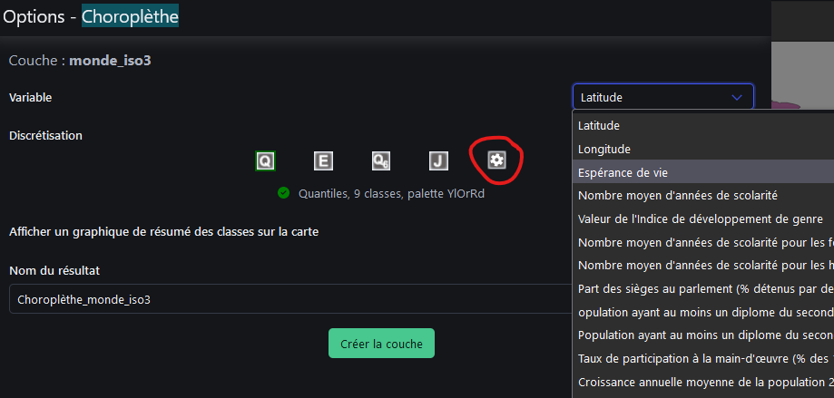
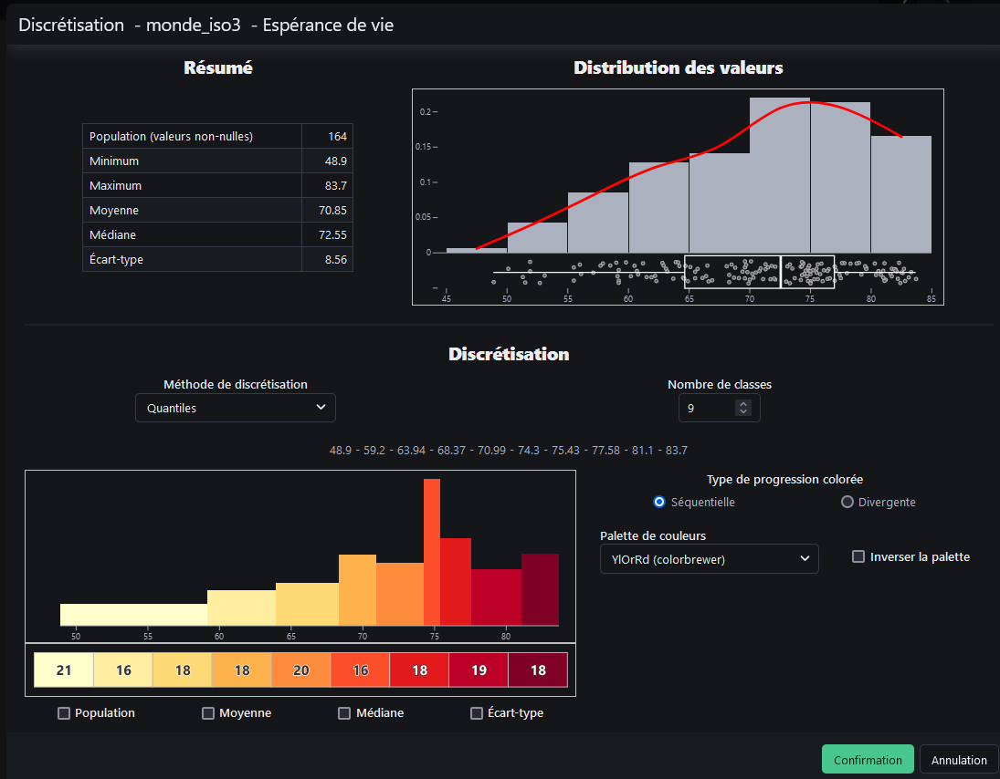

```{r setup, global_options,include=FALSE}
knitr::opts_chunk$set(
  dpi = 200,
  strip.white = T,
  message = FALSE,
  comment = NA,
  echo = FALSE,
  warning = FALSE,
  eval = TRUE
  
)
```

```{r include=FALSE}
source('./assets/functions.R')

requiredPackages = c('knitr','png','grid','gridExtra',
                     'RColorBrewer','dotenv')

PackageFacile(requiredPackages)

load_dot_env(".env")
annee = Sys.getenv("annee")

```


class: center, middle, inverse, title-slide, animated, fadeIn
# Analyse des données Licence Pro `r annee`
# TD n°4- La discrétisation en cartographie<br /> <br />
### Florian Bayer

<div class="my-footer"><span>Géodata Paris - Licence Pro `r annee` : analyse de données - Florian Bayer</span></div>

---
class: animated, fadeIn
## Organisation du TD 4 - Groupes de travail
<div class="my-footer"><span>Géodata Paris - Licence Pro `r annee` : analyse de données - Florian Bayer</span></div>

**Première partie** : en individuel, tester les méthodes de discrétisation dans Magrit sur la carte de l'espérance de vie du TD 3.

**Deuxième partie** : Travail en groupe « même données, messages opposés » : orienter le message d'une carte par la seule discrétisation, avec **présentation PowerPoint** de 5 minutes par groupe.

**Objectifs pédagogiques** :
- Comprendre l'impact des choix de discrétisation sur le message cartographique
- Justifier une méthode de discrétisation à partir de la forme de la distribution
- Développer l'argumentation scientifique et la présentation orale

---
class: animated, fadeIn
## Objectif du TD 4
<div class="my-footer"><span>Géodata Paris - Licence Pro `r annee` : analyse de données - Florian Bayer</span></div>

Les objectifs de ce TD sont de mettre en application les acquis du cours 4 sur la discrétisation en cartographie.

**Rappel (TD 3)** : dans Magrit, rechargez le fond **monde_iso3.geojson** et les données **hdi-edu.csv**, puis refaites la **jointure** sur le champ ISO_A3.

---
class: inverse, center, middle, animated, fadeIn
# 1- Tester les méthodes de discrétisation

<div class="my-footer-title "></div>

---
class: animated, fadeIn
## Magrit : carte choroplèthe

Vous allez maintenant créer une carte choroplèthe.
- Cliquez sur la cible à côté de la couche monde_iso3.
- Dans la nouvelle fenêtre, choisissez *Choroplèthe*.
- Dans variable, choisissez **esperance_vie**
- Enfin, dans Discrétisation, cliquez sur la discrétisation manuelle <i class="fa-solid fa-gear"></i>


.center-img[
```{r echo=FALSE, out.width="70%"}

```
]


<div class="my-footer"><span>Géodata Paris - Licence Pro `r annee` : analyse de données - Florian Bayer</span></div>

---
class: animated, fadeIn
## Magrit : discrétisation

.pull-left[.font90[Dans la nouvelle fenêtre, des informations sur la distribution s'affichent.

L'objectif de notre carte sera de découvrir la répartition spatiale de l'espérance de vie dans les pays du Monde.

Testez les différentes méthodes (quantiles, Q6, amplitudes égales, moyenne et écart-type, Jenks) et observez l'effet sur la carte. Choisissez la méthode qui vous paraît la plus pertinente en fonction du contexte et de la forme de la distribution.

**Justifiez votre choix par écrit**

**Confirmer** puis **Créer la couche**
]]

.pull-right[.center-img[
```{r echo=FALSE, out.width="100%"}

```
]]


<div class="my-footer"><span>Géodata Paris - Licence Pro `r annee` : analyse de données - Florian Bayer</span></div>


---
class: inverse, center, middle, animated, fadeIn
# 2- Exercice en groupes : même données, messages opposés

<div class="my-footer-title "></div>

---
class: animated, fadeIn
## Mise en situation : deux commanditaires, une seule donnée

<div class="my-footer"><span>Géodata Paris - Licence Pro `r annee` : analyse de données - Florian Bayer</span></div>

Deux ONG préparent chacune un rapport sur la **santé infantile dans le monde**. Elles utilisent **exactement les mêmes données** : la variable **mortalite_infantile** (décès avant 1 an pour 1 000 naissances vivantes).

.pull-left[
**ONG A : « Le monde converge »**

Elle veut montrer que les efforts de santé publique portent leurs fruits : la mortalité infantile est **faible dans la plupart des pays** et les écarts se resserrent.
]

.pull-right[
**ONG B : « La fracture persiste »**

Elle veut obtenir une hausse des financements : la carte doit montrer des **inégalités massives** entre les pays.
]

<br />

**Votre mission** : en tant que bureau d'études en géomatique, produire la carte demandée par **votre** commanditaire, en ne jouant **que sur la discrétisation**.

---
class: animated, fadeIn
## Les règles du jeu

<div class="my-footer"><span>Géodata Paris - Licence Pro `r annee` : analyse de données - Florian Bayer</span></div>

.pull-left[
**Imposé à tous les groupes** :
- La variable : **mortalite_infantile**
- Le fond de carte : **monde_iso3**
- La palette : **YlOrRd** (du jaune au rouge)
- Le titre : *Mortalité infantile dans le monde*
- La source et la méthode de discrétisation en légende
]

.pull-right[
**Vos leviers** :
- La **méthode** de discrétisation
- Le **nombre de classes** (de 3 à 7)
- Les **bornes manuelles** si besoin
]

<br />

**Interdit** : fausser les valeurs, supprimer des pays, oublier le vrai minimum et le vrai maximum, créer des classes qui se chevauchent ou qui laissent des trous.

.content-box-yellow[
Vous avez le droit d'**orienter** le lecteur, pas de lui **mentir** : la carte doit rester techniquement juste.
]

---
class: animated, fadeIn
## Organisation

<div class="my-footer"><span>Géodata Paris - Licence Pro `r annee` : analyse de données - Florian Bayer</span></div>

**6 groupes de 4**. Chaque groupe tire au sort sa mission, **sans la révéler** aux autres groupes :
- **Groupes 1 à 3** : ONG A « Le monde converge »
- **Groupes 4 à 6** : ONG B « La fracture persiste »

**Étapes** :
1. **Analyser la distribution** de mortalite_infantile dans Magrit : forme, valeurs centrales, dispersion, valeurs extrêmes.
2. **Tester plusieurs discrétisations** et observer l'effet sur la carte.
3. **Choisir** la discrétisation qui sert le mieux votre message.
4. **Mettre en page** la carte et préparer 2 à 4 slides PowerPoint.

---
class: animated, fadeIn
## Restitution : qui a commandé cette carte ?

<div class="my-footer"><span>Géodata Paris - Licence Pro `r annee` : analyse de données - Florian Bayer</span></div>

Pour chaque groupe (5 minutes) :

**1. La carte seule** (30 secondes, sans commentaire) :
- La salle vote : ONG A ou ONG B ?
- Quel levier a été utilisé selon vous ?

**2. Le groupe révèle sa mission et se justifie** :
- Méthode, nombre de classes et bornes choisies
- L'histogramme de la série avec vos bornes de classes
- Pourquoi ce choix sert-il le message de votre commanditaire ?
- Quels pays sont mis en valeur ou « cachés » par votre discrétisation ?

**3. Critique** : les autres groupes peuvent poser une question critique.

---
class: animated, fadeIn
## Débriefing : discrétiser, c'est communiquer

<div class="my-footer"><span>Géodata Paris - Licence Pro `r annee` : analyse de données - Florian Bayer</span></div>

**Questions collectives** :
- Quelles cartes ont trompé la salle ? Lesquelles étaient évidentes ?
- Quels leviers ont été les plus efficaces : la méthode, le nombre de classes, les bornes ?
- Quel rôle a joué la forme (asymétrique) de la distribution ?
- Une carte « neutre » de ces données existe-t-elle ?
- Comment un lecteur peut-il se prémunir : légende, méthode, histogramme ?

**Synthèse pédagogique** :
- **La même donnée peut porter des messages opposés** → la discrétisation est un choix éditorial
- **La forme de la distribution conditionne l'effet de chaque méthode**
- **Transparence méthodologique** → toujours indiquer et justifier sa méthode de discrétisation
- Pour ne pas être accusé de manipulation, les quantiles ou Q6 restent les choix les plus défendables (cf. cours 4)

Cet exercice vous prépare à être des cartographes critiques et responsables !

---
class: animated, fadeIn
## Fin du TD 4

Dans ce TD, vous avez appris :
- A discrétiser une série statistique dans Magrit
- A choisir et justifier une méthode de discrétisation selon la forme de la distribution
- A mesurer l'effet de la discrétisation sur le message cartographique
- A porter un regard critique sur les cartes que vous lisez

Dans le prochain cours, nous verrons ensemble comment mesurer les liens entre deux caractères.

<div class="my-footer"><span>Géodata Paris - Licence Pro `r annee` : analyse de données - Florian Bayer</span></div>
